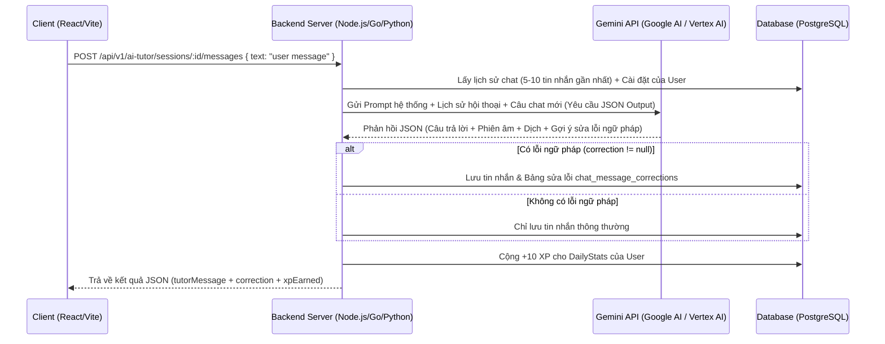
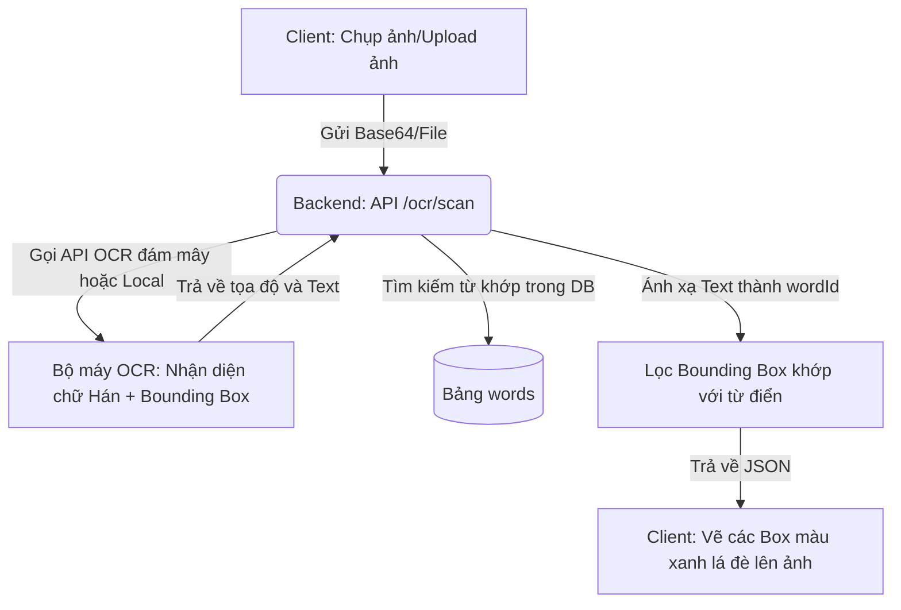
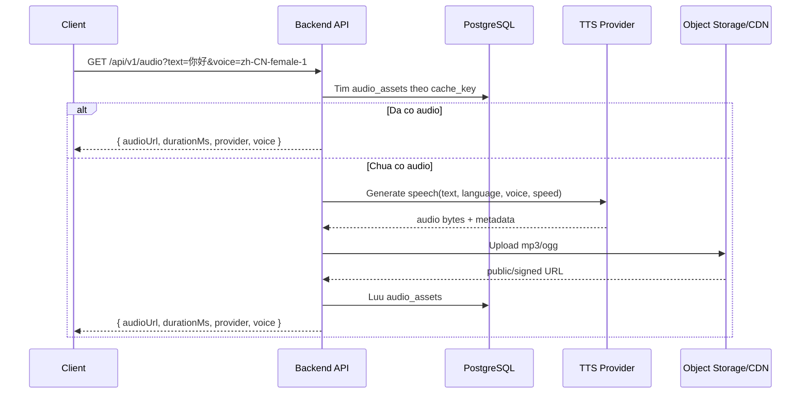

# Thiết kế Kiến trúc Backend & Giải pháp AI (Backend & AI Design)

Tài liệu này mô tả chi tiết phương án triển khai phần Backend xử lý các tính năng thông minh liên quan đến Trí tuệ nhân tạo (AI) trong ứng dụng Study Chinese bao gồm: **Trợ lý ảo AI Tutor (Chat & Sửa lỗi)** và **Nhận diện chữ Hán qua ảnh chụp (Camera Scan OCR)**.

---

## 1. Trợ lý ảo AI Tutor & Chấm lỗi Ngữ pháp (AI Tutor & Grammar Correction)

### 1.1. Luồng hoạt động (Data Flow)



### 1.2. Giải pháp Mô hình đề xuất
*   **Mô hình đề xuất:** **Gemini 1.5 Flash** (hoặc **Gemini 2.0 Flash**).
*   **Lý do lựa chọn:**
    *   Tốc độ phản hồi cực kỳ nhanh (thời gian trễ dưới 1.5 giây), rất thích hợp cho trải nghiệm chat thời gian thực.
    *   Hỗ trợ xuất dữ liệu theo cấu trúc định sẵn (**Structured Outputs / JSON Schema**) cực kỳ mạnh mẽ.
    *   Chi phí API cực kỳ rẻ (hoặc miễn phí với gói giới hạn của Google AI Studio).
    *   Khả năng hiểu và xử lý đa ngôn ngữ (tiếng Trung, Anh, Việt) rất tốt.

### 1.3. Cấu hình Prompt & Định dạng đầu ra (JSON Schema)
Để LLM vừa đóng vai trò gia sư trò chuyện, vừa tự động phát hiện lỗi và sửa lỗi ngữ pháp trong cùng một lượt gọi API, chúng ta cấu hình **System Instruction (System Prompt)** và yêu cầu định dạng đầu ra như sau:

#### System Prompt:
```text
Bạn là Xiao Hong (小红), một gia sư dạy tiếng Trung giao tiếp thân thiện và chu đáo.
Nhiệm vụ của bạn là:
1. Đọc tin nhắn tiếng Trung của học viên.
2. Trả lời lại bằng tiếng Trung giản thể phù hợp với ngữ cảnh kịch bản [Scenario]. Câu trả lời ngắn gọn, tự nhiên, phù hợp với trình độ người mới bắt đầu (HSK 1-3).
3. Đọc kỹ tin nhắn của học viên để phát hiện lỗi:
   - Lỗi ngữ pháp tiếng Trung.
   - Lỗi viết phiên âm Pinyin không dấu (ví dụ: viết "ni hao" thay vì "nǐ hǎo").
   - Lỗi dùng sai từ vựng.
4. Nếu phát hiện lỗi, hãy điền thông tin vào trường "correction". Giải thích lỗi ngắn gọn bằng tiếng Việt. Nếu học viên viết đúng hoàn toàn, hãy để trường "correction" là null.

Hãy trả về phản hồi theo định dạng JSON duy nhất.
```

#### JSON Schema yêu cầu (Structured Output):
```json
{
  "type": "object",
  "properties": {
    "reply_simplified": {
      "type": "string",
      "description": "Câu trả lời của giáo viên bằng chữ Hán giản thể."
    },
    "reply_pinyin": {
      "type": "string",
      "description": "Phiên âm Pinyin đầy đủ có dấu của câu trả lời giáo viên."
    },
    "reply_english": {
      "type": "string",
      "description": "Bản dịch nghĩa tiếng Anh của câu trả lời giáo viên."
    },
    "has_error": {
      "type": "boolean",
      "description": "True nếu tin nhắn học viên có lỗi ngữ pháp/phát âm/viết sai, ngược lại là False."
    },
    "correction": {
      "type": "object",
      "nullable": true,
      "properties": {
        "original": { "type": "string", "description": "Câu gốc có lỗi của học viên." },
        "improved": { "type": "string", "description": "Câu đề xuất đã sửa đúng ngữ pháp và phiên âm có dấu." },
        "explanation": { "type": "string", "description": "Lời giải thích lỗi sai bằng tiếng Việt ngắn gọn, dễ hiểu." }
      },
      "required": ["original", "improved", "explanation"]
    }
  },
  "required": ["reply_simplified", "reply_pinyin", "reply_english", "has_error", "correction"]
}
```

---

## 2. Nhận diện hình ảnh và dịch chữ Hán (Camera Scan OCR & Word Mapping)

Tính năng này cho phép người dùng chụp ảnh các biển báo, menu món ăn, sách báo... và nhấp chọn trực tiếp vào các từ vựng chữ Hán để học và đưa vào hệ thống thẻ nhớ ôn tập SRS.

### 2.1. Luồng hoạt động (Data Flow)



### 2.2. Phương án và Mô hình OCR đề xuất

#### Phương án A: Sử dụng Cloud API (Khuyên dùng cho production)
*   **Mô hình:** **Google Cloud Vision API (Text Detection)**.
*   **Ưu điểm:**
    *   Khả năng nhận diện chữ Hán (Hanzi) chính xác nhất hiện nay, kể cả chữ viết tay, chữ nghệ thuật trên biển hiệu, chữ bị nghiêng/mờ.
    *   Trả về tọa độ chi tiết của từng từ (Bounding box dạng tỷ lệ % hoặc pixel) để Client vẽ trực quan.
*   **Nhược điểm:** Tốn chi phí API sau khi vượt quá hạn mức miễn phí (1000 lượt yêu cầu/tháng).

#### Phương án B: Sử dụng thư viện chạy ở Backend (Tự host - Miễn phí)
*   **Mô hình:** **PaddleOCR** (dựa trên PaddlePaddle của Baidu) hoặc **EasyOCR**.
*   **Lý do đề xuất:** PaddleOCR là mô hình mã nguồn mở tốt nhất thế giới hiện nay cho việc nhận diện ký tự tiếng Trung (độ chính xác vượt trội hơn hẳn Tesseract OCR).
*   **Triển khai:** Viết một dịch vụ nhỏ bằng Python (sử dụng FastAPI), gọi thư viện `paddleocr` để nhận diện và trả về tọa độ chữ cho Backend chính.

### 2.3. Thuật toán khớp từ vựng của Backend (Word Mapping Algorithm)

Khi OCR trả về danh sách các từ phát hiện được cùng tọa độ của chúng (ví dụ: phát hiện được từ `"中国"` tại tọa độ `[x: 120, y: 150]`), Backend cần ánh xạ chúng vào bảng cơ sở dữ liệu `words` để lấy thông tin từ vựng đầy đủ:

1.  **Truy vấn chính xác (Exact Match):**
    *   Tìm kiếm trong bảng `words` các bản ghi có `simplified = detected_text` hoặc `traditional = detected_text`.
    *   Nếu tìm thấy, lấy `word_id` và đính kèm vào thông tin bounding box.
2.  **Truy vấn cắt từ (Sub-string Tokenization):**
    *   Đôi khi OCR trả về một câu dài như `"我想喝茶"`.
    *   Backend sẽ chạy qua một bộ phân tách từ tiếng Trung (Chinese Segmenter) như thư viện **Jieba** (Python/Node.js) để tách câu thành mảng từ tố: `["我", "想", "喝", "茶"]`.
    *   Duyệt qua từng từ tố để truy vấn cơ sở dữ liệu. Nếu từ tố nào khớp với bảng `words` (ví dụ: `"喝"`, `"茶"`), ta sẽ tạo một bounding box nhỏ tương ứng cho từ vựng đó dựa trên tỷ lệ độ dài ký tự trong ô chữ nhật lớn của câu.
3.  **Dữ liệu trả về Client:**
    *   Trả về danh sách đối tượng chứa tọa độ `top, left, width, height` (dưới dạng phần trăm để tránh lỗi lệch khi đổi kích thước màn hình điện thoại) cùng với ID từ vựng `wordId` để Client gọi được tính năng `+ Study Word (SRS)`.
 

---

## 3. Giai phap am thanh mau (Audio Sample / TTS)

Tinh nang am thanh mau giup nguoi hoc nghe phat am chuan cho tu vung, cau hoi thoai, bai nghe va cau tra loi cua AI Tutor. Client hien co the dung `window.speechSynthesis`, nhung cach nay phu thuoc trinh duyet, chat luong giong doc khong dong nhat va kho cache offline. Production nen dua viec tao am thanh ve Backend, luu file audio da sinh va tra ve `audioUrl` on dinh cho Client.

### 3.1. Muc tieu

- Co am thanh mau chat luong on dinh cho Hanzi, pinyin va cau hoi thoai.
- Giam chi phi TTS bang cache: cung mot text/voice/speed thi chi tao audio mot lan.
- Ho tro nhieu ngu canh: tu vung don, cau trong lesson, dialogue line, AI Tutor reply, shadowing prompt.
- Cho phep fallback ve browser `speechSynthesis` khi backend audio chua san sang.
- Luu metadata de sau nay danh gia chat luong, doi provider hoac tao lai audio hang loat.

### 3.2. Luong hoat dong



### 3.3. Provider de xuat

#### Phuong an A: Cloud TTS cho production

- **Google Cloud Text-to-Speech** hoac **Azure AI Speech**.
- Uu diem:
  - Giong Mandarin on dinh, co nhieu voice nam/nu.
  - Ho tro SSML de dieu chinh toc do, pause, pronunciation.
  - De scale, do tre thap, chat luong phu hop hoc phat am.
- Nhuoc diem:
  - Ton chi phi theo so ky tu.
  - Can quan ly quota, retry va billing.

#### Phuong an B: Open-source/self-host cho dev hoac tiet kiem chi phi

- Co the dung Piper, Coqui TTS hoac mot service Python rieng neu co model tieng Trung phu hop.
- Uu diem:
  - Khong phu thuoc provider cloud.
  - Co the chay noi bo cho noi dung seed.
- Nhuoc diem:
  - Chat luong Mandarin va tone co the khong bang cloud TTS.
  - Can tu van hanh model, CPU/GPU, cache va monitoring.

#### Phuong an C: Fallback client-side

- Khi `audioUrl` khong co, Client dung `speechSynthesis` voi `lang="zh-CN"`.
- Chi nen xem la fallback, khong phai nguon audio chinh.

### 3.4. Thiet ke API

#### Lay hoac tao audio theo text

```http
GET /api/v1/audio?text=你好&language=zh-CN&voice=zh-CN-female-1&speed=1.0
Authorization: Bearer <token>
```

Response:

```json
{
  "status": "success",
  "data": {
    "audio": {
      "id": "aud_...",
      "text": "你好",
      "language": "zh-CN",
      "voice": "zh-CN-female-1",
      "speed": 1,
      "provider": "google_tts",
      "audioUrl": "https://cdn.example.com/audio/zh-CN/aud_....mp3",
      "mimeType": "audio/mpeg",
      "durationMs": 820,
      "cacheKey": "sha256:..."
    }
  }
}
```

#### Tao audio hang loat cho content seed/admin

```http
POST /api/v1/audio/batch
Authorization: Bearer <admin-token>
Content-Type: application/json
```

Request:

```json
{
  "items": [
    { "resourceType": "word", "resourceId": "wd_hello", "text": "你好" },
    { "resourceType": "dialogue_line", "resourceId": "dl1_3_1", "text": "你好！" }
  ],
  "language": "zh-CN",
  "voice": "zh-CN-female-1",
  "speed": 1
}
```

Response:

```json
{
  "status": "success",
  "data": {
    "created": 2,
    "reused": 0,
    "failed": []
  }
}
```

### 3.5. Thiet ke database

Them bang `audio_assets` de cache va lien ket audio voi noi dung hoc tap:

```sql
CREATE TABLE IF NOT EXISTS audio_assets (
  id UUID PRIMARY KEY DEFAULT gen_random_uuid(),
  cache_key VARCHAR(128) UNIQUE NOT NULL,
  resource_type VARCHAR(40),
  resource_id VARCHAR(100),
  text TEXT NOT NULL,
  language VARCHAR(20) NOT NULL DEFAULT 'zh-CN',
  voice VARCHAR(80) NOT NULL,
  speed DECIMAL(4,2) NOT NULL DEFAULT 1.00,
  provider VARCHAR(50) NOT NULL,
  storage_key TEXT NOT NULL,
  audio_url TEXT NOT NULL,
  mime_type VARCHAR(50) NOT NULL DEFAULT 'audio/mpeg',
  duration_ms INT,
  text_hash VARCHAR(128) NOT NULL,
  metadata JSONB,
  created_at TIMESTAMPTZ NOT NULL DEFAULT now(),
  updated_at TIMESTAMPTZ NOT NULL DEFAULT now()
);

CREATE INDEX idx_audio_assets_resource
ON audio_assets (resource_type, resource_id);

CREATE INDEX idx_audio_assets_text_hash
ON audio_assets (text_hash);
```

`cache_key` nen duoc tao tu cac thanh phan:

```text
sha256(normalized_text + language + voice + speed + provider + audio_format)
```

### 3.6. Tich hop vao response hien co

Backend nen tra them `audioUrl` neu da co audio:

- `GET /vocab`: moi word co `audioUrl`.
- `GET /lessons/:id`: `newWords`, `dialogue.lines`, `exercises` co `audioUrl` neu phu hop.
- `GET /ai-tutor/sessions/:id/messages` va `POST /ai-tutor/sessions/:id/messages`: tutor message co `audioUrl`.
- `GET /practice/shadowing-prompts`: moi prompt co `audioUrl`.

Neu chua tao san audio, Backend co the tra `audioUrl: null` va Client goi lazy endpoint `/audio` khi nguoi dung bam nut nghe.

### 3.7. Quy tac tao audio

- Normalize text truoc khi tao cache key: trim, gom whitespace, chuan hoa punctuation Trung/Anh.
- Chi tao audio cho text hop le va gioi han do dai, vi du toi da 300 ky tu cho endpoint sync.
- Text dai hon nen dua vao queue async va tra ve trang thai `pending`.
- Dung SSML neu can pause giua cac cau hoi thoai hoac nhan manh tone.
- Luu file dang `mp3` cho tuong thich rong; co the them `ogg/webm` neu can toi uu web.
- Nen pre-generate audio cho content seed quan trong: vocab HSK, dialogue, phrase of the day, shadowing prompts.

### 3.8. Bao mat va van hanh

- Khong de Client goi truc tiep TTS provider bang API key.
- Rate limit endpoint tao audio theo user/IP de tranh bi lam dung chi phi.
- Log provider, latency, so ky tu, cache hit/miss va loi provider.
- Dung signed URL neu audio private; voi content hoc tap chung co the dung public CDN.
- Neu provider loi, tra response ro rang va cho Client fallback ve `speechSynthesis`.
- Them job nen de generate lai audio khi doi voice/provider hoac sua content.
