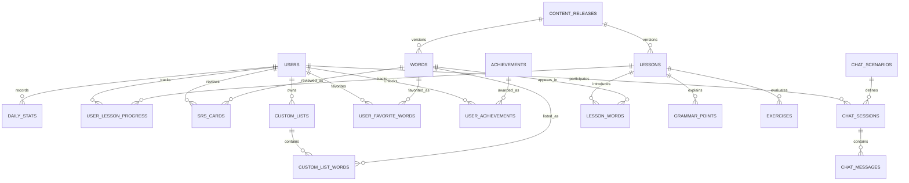

# Thiết kế Cơ sở Dữ liệu Production cho Study Chinese

Tài liệu này mô tả thiết kế cơ sở dữ liệu mục tiêu cho backend production của Study Chinese. Thiết kế sử dụng **PostgreSQL** theo mô hình **hybrid relational + JSONB**:

- Dùng quan hệ chuẩn và foreign key cho dữ liệu nghiệp vụ cần toàn vẹn, query và audit.
- Dùng `JSONB` cho dữ liệu nội dung lồng, đọc theo cụm và ít cần join chi tiết.
- Dùng `TIMESTAMPTZ` cho mọi timestamp phát sinh từ user/system để tránh lỗi timezone.
- Ưu tiên index rõ ràng cho các luồng chính: học bài, ôn SRS, thống kê, tìm từ vựng, AI chat.

Thiết kế production này không còn tối ưu theo hướng "ít bảng nhất". Số bảng tăng lên khoảng **21 bảng** để đổi lấy foreign key thật, lịch sử thao tác, khả năng mở rộng và query ổn định hơn.

---

## 1. Nguyên tắc thiết kế

### 1.1. Giữ JSONB ở nơi phù hợp

Nên dùng `JSONB` cho các cấu trúc có tính tài liệu:

- `lessons.dialogue`: hội thoại của bài học.
- `grammar_points.examples`: ví dụ ngữ pháp.
- `grammar_library.examples`: ví dụ trong thư viện tra cứu.
- `chat_messages.correction`: dữ liệu sửa lỗi AI.

Các dữ liệu này thường được đọc nguyên cụm, ít cần join từng dòng riêng lẻ.

### 1.2. Không dùng array cho quan hệ nghiệp vụ quan trọng

Không dùng array cho các quan hệ cần foreign key, filter, audit hoặc mở rộng metadata:

- Không dùng `lessons.new_word_ids`.
- Không dùng `custom_lists.word_ids`.
- Không dùng `users.favorite_word_ids`.
- Không dùng `users.unlocked_achievement_ids`.

Thay vào đó dùng bảng join:

- `lesson_words`
- `custom_list_words`
- `user_favorite_words`
- `user_achievements`

### 1.3. Timezone và date key

- Dùng `TIMESTAMPTZ` cho `created_at`, `updated_at`, `completed_at`, `due_date`, `last_reviewed_at`, `unlocked_at`.
- Dùng `DATE` cho `daily_stats.date_key`.
- `date_key` nên được tính theo timezone của user nếu sau này app hỗ trợ nhiều khu vực. Giai đoạn đầu có thể dùng timezone mặc định của app, nhưng rule này phải nằm ở service layer.

### 1.4. Content versioning

Nội dung học tập có thể thay đổi sau khi user đã học. Production cần version để tránh làm vỡ progress cũ.

- `content_releases` quản lý các bản phát hành nội dung.
- `words`, `lessons`, `grammar_points`, `exercises` có `content_version`.
- Khi chỉnh nội dung đã publish, ưu tiên tạo version mới thay vì sửa phá dữ liệu cũ.

---

## 2. ERD tổng quan



---

## 3. Danh sách bảng production

### 3.1. Users & Progress

#### 1. `users`

Lưu tài khoản, cài đặt cá nhân và streak hiện tại.

| Cột | Kiểu | Ràng buộc | Mô tả |
| :--- | :--- | :--- | :--- |
| `id` | UUID | PRIMARY KEY, DEFAULT `gen_random_uuid()` | ID người dùng |
| `email` | VARCHAR(255) | UNIQUE, NOT NULL | Email đăng nhập |
| `password_hash` | VARCHAR(255) | NOT NULL | Mật khẩu đã hash |
| `name` | VARCHAR(100) | NOT NULL, DEFAULT `'Learner'` | Tên hiển thị |
| `avatar` | VARCHAR(255) | DEFAULT `'🐼'` | Emoji hoặc URL avatar |
| `start_level` | VARCHAR(20) | CHECK beginner/elementary/intermediate/advanced | Trình độ xuất phát |
| `goal_purpose` | VARCHAR(20) | CHECK travel/business/hskExam/culture/family/casual | Mục tiêu học |
| `daily_minutes` | INT | NOT NULL, DEFAULT 15 | Mục tiêu học mỗi ngày |
| `show_pinyin` | BOOLEAN | NOT NULL, DEFAULT TRUE | Hiện pinyin |
| `audio_auto_play` | BOOLEAN | NOT NULL, DEFAULT TRUE | Tự phát âm thanh |
| `app_appearance` | VARCHAR(15) | CHECK light/dark/system, DEFAULT `'light'` | Giao diện |
| `has_completed_onboarding` | BOOLEAN | NOT NULL, DEFAULT FALSE | Đã hoàn tất onboarding |
| `timezone` | VARCHAR(64) | NOT NULL, DEFAULT `'UTC'` | Timezone dùng tính streak/date key |
| `current_streak` | INT | NOT NULL, DEFAULT 0 | Streak hiện tại |
| `best_streak` | INT | NOT NULL, DEFAULT 0 | Streak tốt nhất |
| `last_study_date` | DATE | NULL | Ngày học gần nhất theo timezone user |
| `join_date` | TIMESTAMPTZ | NOT NULL, DEFAULT now() | Ngày tham gia |
| `created_at` | TIMESTAMPTZ | NOT NULL, DEFAULT now() | Ngày tạo |
| `updated_at` | TIMESTAMPTZ | NOT NULL, DEFAULT now() | Ngày cập nhật |

#### 2. `daily_stats`

Lưu thống kê học theo ngày.

| Cột | Kiểu | Ràng buộc | Mô tả |
| :--- | :--- | :--- | :--- |
| `user_id` | UUID | FK `users(id)` ON DELETE CASCADE | Người dùng |
| `date_key` | DATE | NOT NULL | Ngày thống kê |
| `xp` | INT | NOT NULL, DEFAULT 0 | XP trong ngày |
| `minutes_studied` | INT | NOT NULL, DEFAULT 0 | Số phút học |
| `lessons_completed` | INT | NOT NULL, DEFAULT 0 | Số bài hoàn thành |
| `words_reviewed` | INT | NOT NULL, DEFAULT 0 | Số từ đã ôn |
| `exercises_correct` | INT | NOT NULL, DEFAULT 0 | Câu đúng |
| `exercises_total` | INT | NOT NULL, DEFAULT 0 | Tổng câu làm |
| `created_at` | TIMESTAMPTZ | NOT NULL, DEFAULT now() | Ngày tạo |
| `updated_at` | TIMESTAMPTZ | NOT NULL, DEFAULT now() | Ngày cập nhật |

Khóa chính: `(user_id, date_key)`.

#### 3. `user_lesson_progress`

Lưu tiến trình học từng bài.

| Cột | Kiểu | Ràng buộc | Mô tả |
| :--- | :--- | :--- | :--- |
| `user_id` | UUID | FK `users(id)` ON DELETE CASCADE | Người dùng |
| `lesson_id` | VARCHAR(50) | FK `lessons(id)` ON DELETE CASCADE | Bài học |
| `completed_at` | TIMESTAMPTZ | NULL | Thời điểm hoàn thành gần nhất |
| `best_accuracy` | DECIMAL(5,2) | NOT NULL, DEFAULT 0.00 | Độ chính xác tốt nhất |
| `attempts` | INT | NOT NULL, DEFAULT 0 | Số lần làm |
| `content_version` | INT | NOT NULL, DEFAULT 1 | Version nội dung khi user học |
| `created_at` | TIMESTAMPTZ | NOT NULL, DEFAULT now() | Ngày tạo |
| `updated_at` | TIMESTAMPTZ | NOT NULL, DEFAULT now() | Ngày cập nhật |

Khóa chính: `(user_id, lesson_id)`.

---

### 3.2. Learning Content

#### 4. `content_releases`

Quản lý version nội dung học tập.

| Cột | Kiểu | Ràng buộc | Mô tả |
| :--- | :--- | :--- | :--- |
| `id` | UUID | PRIMARY KEY, DEFAULT `gen_random_uuid()` | ID release |
| `version` | VARCHAR(50) | UNIQUE, NOT NULL | Ví dụ `2026.06.1` |
| `description` | TEXT | NULL | Ghi chú thay đổi |
| `is_active` | BOOLEAN | NOT NULL, DEFAULT FALSE | Release đang dùng |
| `published_at` | TIMESTAMPTZ | NULL | Thời điểm publish |
| `created_at` | TIMESTAMPTZ | NOT NULL, DEFAULT now() | Ngày tạo |

#### 5. `words`

Từ điển từ vựng.

| Cột | Kiểu | Ràng buộc | Mô tả |
| :--- | :--- | :--- | :--- |
| `id` | VARCHAR(50) | PRIMARY KEY | ID từ, ví dụ `wd_hello` |
| `release_id` | UUID | FK `content_releases(id)` ON DELETE SET NULL | Release nội dung |
| `simplified` | VARCHAR(100) | NOT NULL | Chữ giản thể |
| `traditional` | VARCHAR(100) | NOT NULL | Chữ phồn thể |
| `pinyin` | VARCHAR(150) | NOT NULL | Pinyin có dấu |
| `pinyin_plain` | VARCHAR(150) | NOT NULL | Pinyin bỏ dấu để search |
| `tones` | SMALLINT[] | NOT NULL | Mảng thanh điệu |
| `english` | TEXT | NOT NULL | Nghĩa tiếng Anh |
| `part_of_speech` | VARCHAR(30) | CHECK noun/verb/adjective/adverb/pronoun/numeral/measure/phrase | Từ loại |
| `hsk_level` | INT | NOT NULL, DEFAULT 1 | HSK level |
| `category` | VARCHAR(50) | NOT NULL | Chủ đề |
| `search_text` | TEXT | NOT NULL | Text tổng hợp để search |
| `content_version` | INT | NOT NULL, DEFAULT 1 | Version nội dung |
| `is_active` | BOOLEAN | NOT NULL, DEFAULT TRUE | Còn dùng hay không |
| `created_at` | TIMESTAMPTZ | NOT NULL, DEFAULT now() | Ngày tạo |
| `updated_at` | TIMESTAMPTZ | NOT NULL, DEFAULT now() | Ngày cập nhật |

#### 6. `lessons`

Thông tin bài học và hội thoại lồng.

| Cột | Kiểu | Ràng buộc | Mô tả |
| :--- | :--- | :--- | :--- |
| `id` | VARCHAR(50) | PRIMARY KEY | ID bài học, ví dụ `l1_1` |
| `release_id` | UUID | FK `content_releases(id)` ON DELETE SET NULL | Release nội dung |
| `title` | VARCHAR(150) | NOT NULL | Tiêu đề |
| `subtitle` | VARCHAR(150) | NOT NULL | Phụ đề |
| `hsk_level` | INT | NOT NULL, DEFAULT 1 | HSK level |
| `order_num` | INT | NOT NULL | Thứ tự trong level |
| `skill` | VARCHAR(50) | NOT NULL | Kỹ năng chính |
| `estimated_minutes` | INT | NOT NULL, DEFAULT 5 | Thời lượng dự kiến |
| `xp_reward` | INT | NOT NULL, DEFAULT 20 | XP nhận được |
| `intro` | TEXT | NOT NULL | Giới thiệu bài |
| `dialogue` | JSONB | NULL | Hội thoại lồng |
| `content_version` | INT | NOT NULL, DEFAULT 1 | Version nội dung |
| `is_active` | BOOLEAN | NOT NULL, DEFAULT TRUE | Còn dùng hay không |
| `created_at` | TIMESTAMPTZ | NOT NULL, DEFAULT now() | Ngày tạo |
| `updated_at` | TIMESTAMPTZ | NOT NULL, DEFAULT now() | Ngày cập nhật |

Cấu trúc `dialogue`:

```json
{
  "id": "d1_3",
  "title": "Meeting a friend",
  "scenario": "You run into a friend on the street.",
  "lines": [
    {
      "id": "dl1_3_1",
      "speaker": "A",
      "isUser": true,
      "simplified": "你好！",
      "traditional": "你好！",
      "pinyin": "Nǐ hǎo!",
      "english": "Hello!"
    }
  ]
}
```

#### 7. `lesson_words`

Quan hệ bài học - từ mới. Bảng này thay thế `lessons.new_word_ids`.

| Cột | Kiểu | Ràng buộc | Mô tả |
| :--- | :--- | :--- | :--- |
| `lesson_id` | VARCHAR(50) | FK `lessons(id)` ON DELETE CASCADE | Bài học |
| `word_id` | VARCHAR(50) | FK `words(id)` ON DELETE CASCADE | Từ vựng |
| `order_num` | INT | NOT NULL, DEFAULT 0 | Thứ tự hiển thị |
| `created_at` | TIMESTAMPTZ | NOT NULL, DEFAULT now() | Ngày tạo |

Khóa chính: `(lesson_id, word_id)`.

#### 8. `grammar_points`

Điểm ngữ pháp trong bài học.

| Cột | Kiểu | Ràng buộc | Mô tả |
| :--- | :--- | :--- | :--- |
| `id` | VARCHAR(50) | PRIMARY KEY | ID điểm ngữ pháp |
| `lesson_id` | VARCHAR(50) | FK `lessons(id)` ON DELETE CASCADE | Bài học |
| `pattern` | VARCHAR(255) | NOT NULL | Mẫu cấu trúc |
| `explanation` | TEXT | NOT NULL | Giải thích |
| `tips` | TEXT[] | NOT NULL, DEFAULT `'{}'` | Mẹo học nhanh |
| `examples` | JSONB | NOT NULL, DEFAULT `'[]'` | Ví dụ lồng |
| `order_num` | INT | NOT NULL | Thứ tự |
| `content_version` | INT | NOT NULL, DEFAULT 1 | Version nội dung |
| `created_at` | TIMESTAMPTZ | NOT NULL, DEFAULT now() | Ngày tạo |
| `updated_at` | TIMESTAMPTZ | NOT NULL, DEFAULT now() | Ngày cập nhật |

#### 9. `exercises`

Bài tập trong bài học.

| Cột | Kiểu | Ràng buộc | Mô tả |
| :--- | :--- | :--- | :--- |
| `id` | VARCHAR(50) | PRIMARY KEY | ID bài tập |
| `lesson_id` | VARCHAR(50) | FK `lessons(id)` ON DELETE CASCADE | Bài học |
| `kind` | VARCHAR(30) | CHECK multipleChoice/matchPinyin/tonePicker/listening/typing/speaking/arrangeSentence/fillBlank/trueFalse | Loại bài tập |
| `prompt` | TEXT | NOT NULL | Câu hỏi |
| `prompt_hanzi` | VARCHAR(255) | NULL | Gợi ý Hán tự |
| `prompt_pinyin` | VARCHAR(255) | NULL | Gợi ý pinyin |
| `prompt_english` | VARCHAR(255) | NULL | Gợi ý nghĩa |
| `options` | JSONB | NOT NULL, DEFAULT `'[]'` | Lựa chọn đáp án |
| `correct_text` | TEXT | NOT NULL | Đáp án đúng dạng text |
| `correct_index` | INT | NULL | Index đáp án đúng |
| `audio_word_id` | VARCHAR(50) | FK `words(id)` ON DELETE SET NULL | Từ dùng cho audio |
| `tone` | SMALLINT | NULL | Thanh điệu đúng |
| `order_num` | INT | NOT NULL | Thứ tự |
| `content_version` | INT | NOT NULL, DEFAULT 1 | Version nội dung |
| `created_at` | TIMESTAMPTZ | NOT NULL, DEFAULT now() | Ngày tạo |
| `updated_at` | TIMESTAMPTZ | NOT NULL, DEFAULT now() | Ngày cập nhật |

---

### 3.3. SRS, Favorites & Custom Lists

#### 10. `srs_cards`

Thẻ ôn tập giãn cách theo user và word.

| Cột | Kiểu | Ràng buộc | Mô tả |
| :--- | :--- | :--- | :--- |
| `user_id` | UUID | FK `users(id)` ON DELETE CASCADE | Người dùng |
| `word_id` | VARCHAR(50) | FK `words(id)` ON DELETE CASCADE | Từ vựng |
| `ease_factor` | DECIMAL(4,2) | NOT NULL, DEFAULT 2.50 | Hệ số dễ |
| `interval_days` | DECIMAL(6,2) | NOT NULL, DEFAULT 0.00 | Khoảng cách ôn |
| `repetitions` | INT | NOT NULL, DEFAULT 0 | Số lần đúng liên tiếp theo SRS |
| `due_date` | TIMESTAMPTZ | NOT NULL, DEFAULT now() | Hạn ôn tiếp theo |
| `last_reviewed_at` | TIMESTAMPTZ | NULL | Lần ôn gần nhất |
| `correct_streak` | INT | NOT NULL, DEFAULT 0 | Chuỗi đúng |
| `wrong_count` | INT | NOT NULL, DEFAULT 0 | Số lần sai |
| `mastery_level` | VARCHAR(20) | CHECK new/learning/young/mature/mastered, DEFAULT `'new'` | Mức thành thạo |
| `created_at` | TIMESTAMPTZ | NOT NULL, DEFAULT now() | Ngày tạo |
| `updated_at` | TIMESTAMPTZ | NOT NULL, DEFAULT now() | Ngày cập nhật |

Khóa chính: `(user_id, word_id)`.

#### 11. `user_favorite_words`

Từ yêu thích của user. Bảng này thay thế `users.favorite_word_ids`.

| Cột | Kiểu | Ràng buộc | Mô tả |
| :--- | :--- | :--- | :--- |
| `user_id` | UUID | FK `users(id)` ON DELETE CASCADE | Người dùng |
| `word_id` | VARCHAR(50) | FK `words(id)` ON DELETE CASCADE | Từ yêu thích |
| `created_at` | TIMESTAMPTZ | NOT NULL, DEFAULT now() | Thời điểm favorite |

Khóa chính: `(user_id, word_id)`.

#### 12. `custom_lists`

Danh sách từ vựng tự tạo.

| Cột | Kiểu | Ràng buộc | Mô tả |
| :--- | :--- | :--- | :--- |
| `id` | UUID | PRIMARY KEY, DEFAULT `gen_random_uuid()` | ID danh sách |
| `user_id` | UUID | FK `users(id)` ON DELETE CASCADE | Chủ sở hữu |
| `name` | VARCHAR(100) | NOT NULL | Tên danh sách |
| `emoji` | VARCHAR(50) | DEFAULT `'📗'` | Biểu tượng |
| `created_at` | TIMESTAMPTZ | NOT NULL, DEFAULT now() | Ngày tạo |
| `updated_at` | TIMESTAMPTZ | NOT NULL, DEFAULT now() | Ngày cập nhật |

#### 13. `custom_list_words`

Các từ nằm trong custom list. Bảng này thay thế `custom_lists.word_ids`.

| Cột | Kiểu | Ràng buộc | Mô tả |
| :--- | :--- | :--- | :--- |
| `list_id` | UUID | FK `custom_lists(id)` ON DELETE CASCADE | Danh sách |
| `word_id` | VARCHAR(50) | FK `words(id)` ON DELETE CASCADE | Từ vựng |
| `order_num` | INT | NOT NULL, DEFAULT 0 | Thứ tự trong list |
| `created_at` | TIMESTAMPTZ | NOT NULL, DEFAULT now() | Thời điểm thêm |

Khóa chính: `(list_id, word_id)`.

---

### 3.4. Achievements

#### 14. `achievements`

Danh mục thành tựu hệ thống.

| Cột | Kiểu | Ràng buộc | Mô tả |
| :--- | :--- | :--- | :--- |
| `id` | VARCHAR(50) | PRIMARY KEY | ID thành tựu |
| `title` | VARCHAR(100) | NOT NULL | Tên |
| `description` | TEXT | NOT NULL | Điều kiện |
| `emoji` | VARCHAR(50) | NOT NULL | Biểu tượng |
| `target_value` | INT | NOT NULL | Ngưỡng đạt |
| `category` | VARCHAR(30) | CHECK lessons/streak/vocabulary/xp/hsk/skill | Nhóm điều kiện |
| `is_active` | BOOLEAN | NOT NULL, DEFAULT TRUE | Còn dùng hay không |
| `created_at` | TIMESTAMPTZ | NOT NULL, DEFAULT now() | Ngày tạo |

#### 15. `user_achievements`

Thành tựu user đã mở khóa. Bảng này thay thế `users.unlocked_achievement_ids`.

| Cột | Kiểu | Ràng buộc | Mô tả |
| :--- | :--- | :--- | :--- |
| `user_id` | UUID | FK `users(id)` ON DELETE CASCADE | Người dùng |
| `achievement_id` | VARCHAR(50) | FK `achievements(id)` ON DELETE CASCADE | Thành tựu |
| `unlocked_at` | TIMESTAMPTZ | NOT NULL, DEFAULT now() | Thời điểm mở khóa |
| `trigger_context` | JSONB | NULL | Context khi unlock, ví dụ `{ "streak": 7 }` |

Khóa chính: `(user_id, achievement_id)`.

---

### 3.5. AI Tutor

#### 16. `chat_scenarios`

Kịch bản hội thoại AI.

| Cột | Kiểu | Ràng buộc | Mô tả |
| :--- | :--- | :--- | :--- |
| `id` | VARCHAR(50) | PRIMARY KEY | ID kịch bản |
| `title` | VARCHAR(100) | NOT NULL | Tiêu đề |
| `emoji` | VARCHAR(50) | NOT NULL | Biểu tượng |
| `description` | TEXT | NOT NULL | Mô tả ngữ cảnh |
| `init_msg_simplified` | TEXT | NOT NULL | Tin nhắn đầu bằng Hán tự |
| `init_msg_pinyin` | TEXT | NOT NULL | Pinyin |
| `init_msg_english` | TEXT | NOT NULL | Dịch nghĩa |
| `is_active` | BOOLEAN | NOT NULL, DEFAULT TRUE | Còn dùng hay không |
| `created_at` | TIMESTAMPTZ | NOT NULL, DEFAULT now() | Ngày tạo |
| `updated_at` | TIMESTAMPTZ | NOT NULL, DEFAULT now() | Ngày cập nhật |

#### 17. `chat_sessions`

Phiên trò chuyện của user.

| Cột | Kiểu | Ràng buộc | Mô tả |
| :--- | :--- | :--- | :--- |
| `id` | UUID | PRIMARY KEY, DEFAULT `gen_random_uuid()` | ID phiên chat |
| `user_id` | UUID | FK `users(id)` ON DELETE CASCADE | Người dùng |
| `scenario_id` | VARCHAR(50) | FK `chat_scenarios(id)` ON DELETE SET NULL | Kịch bản |
| `title` | VARCHAR(150) | NULL | Tiêu đề phiên |
| `created_at` | TIMESTAMPTZ | NOT NULL, DEFAULT now() | Ngày tạo |
| `updated_at` | TIMESTAMPTZ | NOT NULL, DEFAULT now() | Ngày cập nhật |

#### 18. `chat_messages`

Tin nhắn chat và dữ liệu sửa lỗi AI.

| Cột | Kiểu | Ràng buộc | Mô tả |
| :--- | :--- | :--- | :--- |
| `id` | UUID | PRIMARY KEY, DEFAULT `gen_random_uuid()` | ID tin nhắn |
| `session_id` | UUID | FK `chat_sessions(id)` ON DELETE CASCADE | Phiên chat |
| `role` | VARCHAR(10) | CHECK user/tutor/system | Vai trò |
| `raw_text` | TEXT | NOT NULL | Text gốc user nhập hoặc tutor trả lời |
| `normalized_simplified` | TEXT | NULL | Câu chuẩn bằng giản thể nếu có |
| `pinyin` | TEXT | NULL | Pinyin |
| `english` | TEXT | NULL | Dịch nghĩa |
| `correction` | JSONB | NULL | `{ original, improved, explanation }` |
| `model_name` | VARCHAR(100) | NULL | Model AI đã dùng |
| `token_usage` | JSONB | NULL | Token/cost metadata nếu cần |
| `created_at` | TIMESTAMPTZ | NOT NULL, DEFAULT now() | Thời điểm gửi |

Lý do dùng `raw_text`: user có thể nhập tiếng Trung sai, pinyin không dấu, tiếng Anh hoặc câu trộn nhiều ngôn ngữ. Không nên bắt buộc field `simplified` cho mọi message.

---

### 3.6. Utilities

#### 19. `daily_phrases`

Câu gợi ý trang chủ.

| Cột | Kiểu | Ràng buộc | Mô tả |
| :--- | :--- | :--- | :--- |
| `id` | SERIAL | PRIMARY KEY | ID |
| `simplified` | VARCHAR(255) | NOT NULL | Chữ giản thể |
| `pinyin` | VARCHAR(255) | NOT NULL | Pinyin |
| `english` | TEXT | NOT NULL | Dịch nghĩa |
| `note` | TEXT | NULL | Ghi chú văn hóa |
| `is_active` | BOOLEAN | NOT NULL, DEFAULT TRUE | Còn dùng hay không |
| `created_at` | TIMESTAMPTZ | NOT NULL, DEFAULT now() | Ngày tạo |

#### 20. `grammar_library`

Thư viện ngữ pháp tra cứu nhanh.

| Cột | Kiểu | Ràng buộc | Mô tả |
| :--- | :--- | :--- | :--- |
| `id` | VARCHAR(50) | PRIMARY KEY | ID mục ngữ pháp |
| `title` | VARCHAR(150) | NOT NULL | Tiêu đề |
| `pattern` | VARCHAR(255) | NOT NULL | Mẫu cấu trúc |
| `summary` | TEXT | NOT NULL | Tóm tắt |
| `examples` | JSONB | NOT NULL, DEFAULT `'[]'` | Ví dụ lồng |
| `search_text` | TEXT | NOT NULL | Text tổng hợp để search |
| `is_active` | BOOLEAN | NOT NULL, DEFAULT TRUE | Còn dùng hay không |
| `created_at` | TIMESTAMPTZ | NOT NULL, DEFAULT now() | Ngày tạo |
| `updated_at` | TIMESTAMPTZ | NOT NULL, DEFAULT now() | Ngày cập nhật |

#### 21. `ocr_scan_events`

Log tùy chọn cho tính năng OCR. Không bắt buộc lưu ảnh gốc; nếu lưu, chỉ lưu URL đã kiểm soát bảo mật.

| Cột | Kiểu | Ràng buộc | Mô tả |
| :--- | :--- | :--- | :--- |
| `id` | UUID | PRIMARY KEY, DEFAULT `gen_random_uuid()` | ID scan |
| `user_id` | UUID | FK `users(id)` ON DELETE SET NULL | Người dùng |
| `provider` | VARCHAR(50) | NOT NULL | `google_vision`, `paddleocr`, `mock` |
| `detected_text` | TEXT | NULL | Text OCR trả về |
| `matched_word_ids` | JSONB | NOT NULL, DEFAULT `'[]'` | Word IDs đã match |
| `metadata` | JSONB | NULL | Latency, confidence, dimensions |
| `created_at` | TIMESTAMPTZ | NOT NULL, DEFAULT now() | Thời điểm scan |

---

## 4. Index production đề xuất

### 4.1. Users, progress, stats

```sql
CREATE INDEX idx_users_email_lower ON users (lower(email));
CREATE INDEX idx_daily_stats_user_date ON daily_stats (user_id, date_key DESC);
CREATE INDEX idx_user_lesson_progress_user ON user_lesson_progress (user_id);
CREATE INDEX idx_user_lesson_progress_lesson ON user_lesson_progress (lesson_id);
```

### 4.2. Learning content

```sql
CREATE INDEX idx_lessons_hsk_order ON lessons (hsk_level, order_num) WHERE is_active = true;
CREATE INDEX idx_lesson_words_word ON lesson_words (word_id);
CREATE INDEX idx_grammar_points_lesson_order ON grammar_points (lesson_id, order_num);
CREATE INDEX idx_exercises_lesson_order ON exercises (lesson_id, order_num);
```

### 4.3. Vocabulary search

```sql
CREATE INDEX idx_words_simplified ON words (simplified);
CREATE INDEX idx_words_traditional ON words (traditional);
CREATE INDEX idx_words_pinyin_plain ON words (pinyin_plain);
CREATE INDEX idx_words_hsk_category ON words (hsk_level, category);
CREATE INDEX idx_words_active ON words (is_active);
```

Nếu cần search linh hoạt hơn, bật extension `pg_trgm`:

```sql
CREATE EXTENSION IF NOT EXISTS pg_trgm;

CREATE INDEX idx_words_search_trgm
ON words
USING gin (search_text gin_trgm_ops);

CREATE INDEX idx_grammar_library_search_trgm
ON grammar_library
USING gin (search_text gin_trgm_ops);
```

### 4.4. SRS

```sql
CREATE INDEX idx_srs_cards_due ON srs_cards (user_id, due_date);
CREATE INDEX idx_srs_cards_mastery ON srs_cards (user_id, mastery_level);
```

### 4.5. Favorites, lists, achievements

```sql
CREATE INDEX idx_user_favorite_words_word ON user_favorite_words (word_id);
CREATE INDEX idx_custom_lists_user ON custom_lists (user_id, created_at DESC);
CREATE INDEX idx_custom_list_words_word ON custom_list_words (word_id);
CREATE INDEX idx_user_achievements_achievement ON user_achievements (achievement_id);
```

### 4.6. AI chat và OCR

```sql
CREATE INDEX idx_chat_sessions_user_updated ON chat_sessions (user_id, updated_at DESC);
CREATE INDEX idx_chat_messages_session_time ON chat_messages (session_id, created_at);
CREATE INDEX idx_ocr_scan_events_user_time ON ocr_scan_events (user_id, created_at DESC);
```

---

## 5. Ràng buộc và trigger nên có

### 5.1. `updated_at`

Các bảng có `updated_at` nên dùng trigger chung:

```sql
CREATE OR REPLACE FUNCTION set_updated_at()
RETURNS trigger AS $$
BEGIN
  NEW.updated_at = now();
  RETURN NEW;
END;
$$ LANGUAGE plpgsql;
```

Áp dụng cho: `users`, `daily_stats`, `user_lesson_progress`, `words`, `lessons`, `grammar_points`, `exercises`, `srs_cards`, `custom_lists`, `chat_scenarios`, `chat_sessions`, `grammar_library`.

### 5.2. Check constraint quan trọng

```sql
ALTER TABLE daily_stats
  ADD CONSTRAINT chk_daily_stats_non_negative
  CHECK (
    xp >= 0 AND minutes_studied >= 0 AND lessons_completed >= 0
    AND words_reviewed >= 0 AND exercises_correct >= 0
    AND exercises_total >= 0 AND exercises_correct <= exercises_total
  );

ALTER TABLE srs_cards
  ADD CONSTRAINT chk_srs_values
  CHECK (
    ease_factor >= 1.30 AND ease_factor <= 3.00
    AND interval_days >= 0
    AND repetitions >= 0
    AND correct_streak >= 0
    AND wrong_count >= 0
  );
```

---

## 6. Mapping với model client hiện tại

| Client hiện tại | Bảng production |
| :--- | :--- |
| `UserProfile` | `users` |
| `DailyStat` | `daily_stats` |
| `LessonProgress` | `user_lesson_progress` |
| `SRSCard` | `srs_cards` |
| `favoriteWords: string[]` | `user_favorite_words` |
| `unlockedAchievements: string[]` | `user_achievements` |
| `CustomList.wordIds` | `custom_lists` + `custom_list_words` |
| `VOCAB` | `words` |
| `LESSONS` | `lessons`, `lesson_words`, `grammar_points`, `exercises` |
| `CHAT_SCENARIOS` | `chat_scenarios` |
| AI tutor messages | `chat_sessions`, `chat_messages` |
| Camera OCR mock boxes | `ocr_scan_events` nếu cần audit/log |

---

## 7. Migration roadmap từ localStorage sang production DB

### Phase 1: Chuẩn hóa content seed

- Convert `client/src/resources/vocab.ts` thành seed cho `words`.
- Convert `client/src/resources/lessons.ts` thành seed cho `lessons`, `lesson_words`, `grammar_points`, `exercises`.
- Convert `client/src/resources/seedData.ts` thành seed cho `daily_phrases`, `grammar_library`, `chat_scenarios`.

### Phase 2: User data API

- Implement auth thật: `users`, JWT/session.
- Sync profile, stats, progress, SRS từ localStorage lên DB.
- Chạy song song localStorage fallback trong thời gian chuyển đổi.

### Phase 3: Learning API

- `GET /lessons`
- `GET /lessons/:id`
- `POST /lessons/:id/complete`
- `GET /vocab`
- `GET /srs/due`
- `POST /srs/review`

### Phase 4: AI/OCR

- Lưu `chat_sessions`, `chat_messages`.
- Gọi LLM qua backend, không gọi trực tiếp từ client.
- OCR có thể bắt đầu bằng provider mock, sau đó thay bằng Google Vision/PaddleOCR.

---

## 8. Ghi chú triển khai

- Nên dùng migration tool như Prisma Migrate, Drizzle Kit, Knex migrations hoặc node-pg-migrate.
- Không chỉnh schema thủ công trên production.
- Mọi seed content nên idempotent: chạy lại không tạo duplicate.
- Những bảng content nên có `is_active` thay vì xóa cứng, để không làm hỏng progress cũ.
- Những bảng user-owned như `custom_lists`, `srs_cards`, `chat_sessions` có thể xóa cascade theo user.
- Không lưu ảnh OCR base64 trực tiếp trong DB. Nếu cần lưu ảnh, dùng object storage và chỉ lưu URL/key.
