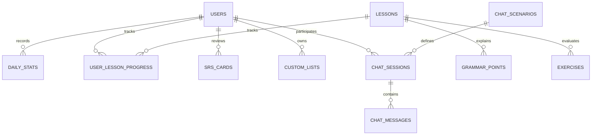

# Thiết kế Cơ sở Dữ liệu Hệ thống Study Chinese (Tối ưu hóa)

Tài liệu này mô tả thiết kế cơ sở dữ liệu đã được **tối ưu hóa** cho ứng dụng Study Chinese. Bằng cách tận dụng các tính năng nâng cao của **PostgreSQL** như kiểu mảng (`Array`) và kiểu dữ liệu bán cấu trúc (`JSONB`), số lượng bảng đã được rút gọn từ **28 bảng xuống còn 15 bảng**.

Sự tối ưu này giúp giảm số lượng lệnh `JOIN`, tăng tốc độ phát triển API ở Backend, đơn giản hóa câu lệnh truy vấn mà vẫn đảm bảo tính toàn vẹn dữ liệu cần thiết.

---

## 1. Các điểm cải tiến Tối ưu hóa (Database Optimization Highlights)

Bằng cách chuyển dịch từ cấu trúc quan hệ thuần túy (Strict Relational) sang mô hình lai giữa Quan hệ và Tài liệu (Relational-Document Hybrid) trên PostgreSQL:

1.  **Gộp mảng nguyên tố (Array Types):**
    *   `words.tones` (`INTEGER[]`): Thay thế bảng `word_tones` bằng cột mảng trực tiếp biểu diễn thanh điệu của từ (Ví dụ: `[3, 3]`).
    *   `lessons.new_word_ids` (`VARCHAR(50)[]`): Thay thế bảng trung gian Nhiều-Nhiều `lesson_words` bằng một mảng danh sách ID từ vựng được giới thiệu trong bài học.
    *   `grammar_points.tips` (`TEXT[]`): Thay thế bảng con `grammar_point_tips` bằng mảng chuỗi trực tiếp.
    *   `exercises.options` (`VARCHAR(255)[]`): Thay thế bảng con `exercise_options` bằng mảng các lựa chọn hiển thị của câu hỏi.
    *   `custom_lists.word_ids` (`VARCHAR(50)[]`): Thay thế bảng liên kết `custom_list_words` bằng mảng lưu trữ danh sách ID từ vựng thuộc danh sách đó.

2.  **Lồng tài liệu phức tạp (JSONB Types):**
    *   `lessons.dialogue` (`JSONB`): Gộp cả bảng `dialogues` và `dialogue_lines` vào một cấu trúc JSONB chứa thông tin tiêu đề, ngữ cảnh và mảng dòng hội thoại lồng nhau.
    *   `grammar_points.examples` (`JSONB`): Gộp bảng ví dụ `example_sentences` thành một mảng các đối tượng chứa câu giản thể, phồn thể, phiên âm, bản dịch.
    *   `grammar_library.examples` (`JSONB`): Gộp bảng ví dụ của thư viện tra cứu nhanh vào bảng chính.
    *   `chat_messages.correction` (`JSONB`): Thay thế bảng `chat_message_corrections` bằng cột JSONB tùy chọn chứa thông tin câu gốc, câu sửa và giải thích của AI.

3.  **Tích hợp thuộc tính phẳng (Flattened Attributes):**
    *   **Chuỗi ngày học liên tục (Streaks):** Đưa trực tiếp `current_streak`, `best_streak`, `last_study_date` vào bảng `users`.
    *   **Thành tựu và Từ yêu thích:** Đưa cột `favorite_word_ids` (`VARCHAR(50)[]`) và `unlocked_achievement_ids` (`VARCHAR(50)[]`) vào bảng `users`. Điều này giúp kiểm tra trạng thái yêu thích hoặc danh hiệu đã mở khóa ngay lập tức khi tải thông tin người dùng mà không cần JOIN.

---

## 2. Sơ đồ Quan hệ Thực thể Tối ưu (Mermaid ERD)



---

## 3. Danh sách 15 Bảng Hệ thống

### 3.1. Nhóm Người dùng & Tiến trình (User & Progress - 3 Bảng)

#### 1. Bảng `users` (Người dùng & Cài đặt & Streaks)
Bảng trung tâm lưu cấu hình giao diện, tiến trình chuỗi ngày học, và danh mục từ yêu thích/thành tựu.

| Tên cột | Kiểu dữ liệu | Ràng buộc | Mô tả |
| :--- | :--- | :--- | :--- |
| `id` | UUID | PRIMARY KEY, DEFAULT gen_random_uuid() | ID duy nhất người dùng |
| `email` | VARCHAR(255) | UNIQUE, NOT NULL | Địa chỉ email đăng nhập |
| `password_hash` | VARCHAR(255) | NOT NULL | Mật khẩu đã băm |
| `name` | VARCHAR(100) | NOT NULL, DEFAULT 'Learner' | Tên hiển thị |
| `avatar` | VARCHAR(50) | DEFAULT '🐼' | Emoji/URL đại diện |
| `start_level` | VARCHAR(20) | CHECK (in 'beginner', 'elementary', 'intermediate', 'advanced') | Trình độ xuất phát |
| `goal_purpose` | VARCHAR(20) | CHECK (in 'travel', 'business', 'hskExam', 'culture', 'family', 'casual') | Mục tiêu học tập |
| `daily_minutes` | INT | NOT NULL, DEFAULT 15 | Mục tiêu học mỗi ngày (phút) |
| `show_pinyin` | BOOLEAN | NOT NULL, DEFAULT TRUE | Hiển thị phiên âm Pinyin |
| `audio_auto_play`| BOOLEAN | NOT NULL, DEFAULT TRUE | Tự động phát âm thanh |
| `app_appearance` | VARCHAR(15) | CHECK (in 'light', 'dark', 'system'), DEFAULT 'light' | Giao diện |
| `has_completed_onboarding` | BOOLEAN | NOT NULL, DEFAULT FALSE | Đã qua onboarding |
| `join_date` | TIMESTAMP | NOT NULL, DEFAULT NOW() | Ngày tham gia |
| `current_streak` | INT | NOT NULL, DEFAULT 0 | Chuỗi ngày học liên tục hiện tại |
| `best_streak` | INT | NOT NULL, DEFAULT 0 | Chuỗi ngày học liên tục tốt nhất |
| `last_study_date`| DATE | NULL | Ngày học gần nhất |
| `favorite_word_ids` | VARCHAR(50)[] | DEFAULT '{}' | Mảng danh sách các ID từ yêu thích |
| `unlocked_achievement_ids` | VARCHAR(50)[] | DEFAULT '{}' | Mảng danh sách ID thành tựu đạt được |
| `created_at` | TIMESTAMP | DEFAULT NOW() | Ngày tạo bản ghi |
| `updated_at` | TIMESTAMP | DEFAULT NOW() | Ngày cập nhật bản ghi |

#### 2. Bảng `daily_stats` (Thống kê hoạt động hàng ngày)
Lưu trữ dữ liệu hoạt động hàng ngày phục vụ vẽ biểu đồ và phân tích thói quen học.

| Tên cột | Kiểu dữ liệu | Ràng buộc | Mô tả |
| :--- | :--- | :--- | :--- |
| `user_id` | UUID | FOREIGN KEY REFERENCES `users(id)` ON DELETE CASCADE | ID người dùng |
| `date_key` | DATE | NOT NULL | Ngày thống kê (định dạng YYYY-MM-DD) |
| `xp` | INT | NOT NULL, DEFAULT 0 | Điểm XP kiếm được trong ngày |
| `minutes_studied`| INT | NOT NULL, DEFAULT 0 | Số phút học trong ngày |
| `lessons_completed`| INT | NOT NULL, DEFAULT 0 | Số bài học hoàn thành trong ngày |
| `words_reviewed` | INT | NOT NULL, DEFAULT 0 | Số từ đã ôn tập SRS trong ngày |
| `exercises_correct`| INT | NOT NULL, DEFAULT 0 | Số câu bài tập đúng trong ngày |
| `exercises_total` | INT | NOT NULL, DEFAULT 0 | Tổng số câu bài tập đã làm |

*Khóa chính:* `(user_id, date_key)`

#### 3. Bảng `user_lesson_progress` (Tiến trình bài học)
Lưu lịch sử hoàn thành từng bài học của từng người dùng.

| Tên cột | Kiểu dữ liệu | Ràng buộc | Mô tả |
| :--- | :--- | :--- | :--- |
| `user_id` | UUID | FOREIGN KEY REFERENCES `users(id)` ON DELETE CASCADE | ID người dùng |
| `lesson_id` | VARCHAR(50) | FOREIGN KEY REFERENCES `lessons(id)` ON DELETE CASCADE | ID bài học |
| `completed_at` | TIMESTAMP | NULL | Thời gian hoàn thành gần nhất |
| `best_accuracy` | DECIMAL(5,2) | NOT NULL, DEFAULT 0.00 | Điểm chính xác cao nhất đạt được (%) |
| `attempts` | INT | NOT NULL, DEFAULT 0 | Số lần làm thử bài học |

*Khóa chính:* `(user_id, lesson_id)`

---

### 3.2. Nhóm Nội dung Học tập (Learning Content - 4 Bảng)

#### 4. Bảng `words` (Từ điển từ vựng)
Danh sách từ điển chính của hệ thống.

| Tên cột | Kiểu dữ liệu | Ràng buộc | Mô tả |
| :--- | :--- | :--- | :--- |
| `id` | VARCHAR(50) | PRIMARY KEY | ID từ vựng (ví dụ: `wd_hello`) |
| `simplified` | VARCHAR(100) | NOT NULL | Chữ giản thể |
| `traditional` | VARCHAR(100) | NOT NULL | Chữ phồn thể |
| `pinyin` | VARCHAR(150) | NOT NULL | Phiên âm Pinyin |
| `tones` | INTEGER[] | NOT NULL | Mảng thanh điệu (ví dụ: `ARRAY[3, 3]`) |
| `english` | TEXT | NOT NULL | Bản dịch tiếng Anh |
| `part_of_speech` | VARCHAR(30) | CHECK (in 'noun', 'verb', 'adjective', 'adverb', 'pronoun', 'numeral', 'measure', 'phrase') | Từ loại |
| `hsk_level` | INT | NOT NULL, DEFAULT 1 | Cấp độ HSK (1-3) |
| `category` | VARCHAR(50) | NOT NULL | Nhóm chủ đề từ vựng |

#### 5. Bảng `lessons` (Thông tin bài học & Hội thoại)
Lưu thông tin lý thuyết bài học và tích hợp cấu trúc đoạn hội thoại đi kèm dưới dạng tài liệu JSONB.

| Tên cột | Kiểu dữ liệu | Ràng buộc | Mô tả |
| :--- | :--- | :--- | :--- |
| `id` | VARCHAR(50) | PRIMARY KEY | ID bài học (ví dụ: `l1_1`) |
| `title` | VARCHAR(150) | NOT NULL | Tiêu đề bài học |
| `subtitle` | VARCHAR(150) | NOT NULL | Phụ đề bài học |
| `hsk_level` | INT | NOT NULL, DEFAULT 1 | Cấp độ HSK |
| `order_num` | INT | NOT NULL | Thứ tự bài học trong cấp độ |
| `skill` | VARCHAR(50) | NOT NULL | Kỹ năng chính |
| `estimated_minutes` | INT | NOT NULL, DEFAULT 5 | Số phút ước lượng học |
| `xp_reward` | INT | NOT NULL, DEFAULT 20 | Số XP nhận được sau khi làm xong |
| `intro` | TEXT | NOT NULL | Nội dung giới thiệu lý thuyết |
| `new_word_ids` | VARCHAR(50)[] | DEFAULT '{}' | Mảng các ID từ vựng mới được dạy trong bài |
| `dialogue` | JSONB | NULL | Cấu trúc hội thoại (Tiêu đề, ngữ cảnh và các câu thoại chi tiết - Xem chi tiết cấu trúc bên dưới) |
| `created_at` | TIMESTAMP | DEFAULT NOW() | Ngày tạo |
| `updated_at` | TIMESTAMP | DEFAULT NOW() | Ngày cập nhật |

*Chi tiết cấu trúc JSONB `dialogue`:*
```json
{
  "id": "d1_3",
  "title": "Meeting a friend",
  "scenario": "You run into a friend on the street.",
  "lines": [
    {
      "id": "dl1_3_1",
      "speaker": "A",
      "isUser": true,
      "simplified": "你好！",
      "traditional": "你好！",
      "pinyin": "Nǐ hǎo!",
      "english": "Hello!"
    },
    {
      "id": "dl1_3_2",
      "speaker": "B",
      "isUser": false,
      "simplified": "你好！",
      "traditional": "你好！",
      "pinyin": "Nǐ hǎo!",
      "english": "Hello!"
    }
  ]
}
```

#### 6. Bảng `grammar_points` (Điểm ngữ pháp & Ví dụ)
Lưu cấu trúc ngữ pháp và tích hợp danh sách ví dụ dưới dạng JSONB.

| Tên cột | Kiểu dữ liệu | Ràng buộc | Mô tả |
| :--- | :--- | :--- | :--- |
| `id` | VARCHAR(50) | PRIMARY KEY | ID điểm ngữ pháp |
| `lesson_id` | VARCHAR(50) | FOREIGN KEY REFERENCES `lessons(id)` ON DELETE CASCADE | ID bài học liên kết |
| `pattern` | VARCHAR(255) | NOT NULL | Mẫu cấu trúc (ví dụ: `A + 是 + B`) |
| `explanation` | TEXT | NOT NULL | Giải thích cách dùng |
| `tips` | TEXT[] | DEFAULT '{}' | Các mẹo nhỏ khi sử dụng ngữ pháp này |
| `examples` | JSONB | DEFAULT '[]' | Mảng các câu ví dụ mẫu (Mỗi đối tượng có dạng: `{simplified, traditional, pinyin, english}`) |
| `order_num` | INT | NOT NULL | Thứ tự hiển thị trong bài học |

#### 7. Bảng `exercises` (Các câu hỏi luyện tập)
Lưu trữ câu hỏi và tích hợp mảng các lựa chọn đáp án trắc nghiệm.

| Tên cột | Kiểu dữ liệu | Ràng buộc | Mô tả |
| :--- | :--- | :--- | :--- |
| `id` | VARCHAR(50) | PRIMARY KEY | ID câu hỏi |
| `lesson_id` | VARCHAR(50) | FOREIGN KEY REFERENCES `lessons(id)` ON DELETE CASCADE | ID bài học liên kết |
| `kind` | VARCHAR(30) | CHECK (in 'multipleChoice', 'matchPinyin', 'tonePicker', 'listening', 'typing', 'speaking', 'arrangeSentence', 'fillBlank', 'trueFalse') | Phân loại dạng bài tập |
| `prompt` | TEXT | NOT NULL | Yêu cầu bài tập |
| `prompt_hanzi` | VARCHAR(255) | NULL | Chữ Hán gợi ý |
| `prompt_pinyin`| VARCHAR(255) | NULL | Phiên âm gợi ý |
| `prompt_english`| VARCHAR(255) | NULL | Bản dịch gợi ý |
| `options` | VARCHAR(255)[] | DEFAULT '{}' | Mảng các lựa chọn đáp án hiển thị |
| `correct_text` | TEXT | NOT NULL | Văn bản đáp án đúng |
| `correct_index`| INT | NULL | Chỉ số phương án đúng trong mảng `options` |
| `audio_word_id`| VARCHAR(50) | NULL, FOREIGN KEY REFERENCES `words(id)` | Từ vựng phát âm thanh nếu là bài nghe |
| `tone` | INT | NULL | Chỉ số thanh điệu đúng (1-4) |
| `order_num` | INT | NOT NULL | Thứ tự câu hỏi |

---

### 3.3. Nhóm Ôn tập & Cá nhân hóa (Review & Customization - 2 Bảng)

#### 8. Bảng `srs_cards` (Thẻ nhớ ôn tập giãn cách)
Quản lý trạng thái ôn tập và độ thành thạo của từng từ vựng đối với từng người dùng.

| Tên cột | Kiểu dữ liệu | Ràng buộc | Mô tả |
| :--- | :--- | :--- | :--- |
| `user_id` | UUID | FOREIGN KEY REFERENCES `users(id)` ON DELETE CASCADE | ID người dùng |
| `word_id` | VARCHAR(50) | FOREIGN KEY REFERENCES `words(id)` ON DELETE CASCADE | ID từ vựng ôn tập |
| `ease_factor` | DECIMAL(4,2) | NOT NULL, DEFAULT 2.50 | Hệ số dễ (SuperMemo-2) |
| `interval_days` | DECIMAL(6,2) | NOT NULL, DEFAULT 0.00 | Số ngày hẹn ôn tập kế tiếp |
| `repetitions` | INT | NOT NULL, DEFAULT 0 | Số lần ôn tập thành công liên tục |
| `due_date` | TIMESTAMP | NOT NULL, DEFAULT NOW() | Hạn ôn tập kế tiếp |
| `last_reviewed_at`| TIMESTAMP | NULL | Thời gian ôn tập gần nhất |
| `correct_streak` | INT | NOT NULL, DEFAULT 0 | Chuỗi ôn tập đúng liên tục |
| `wrong_count` | INT | NOT NULL, DEFAULT 0 | Tổng số lần làm sai từ này |
| `mastery_level` | VARCHAR(20) | CHECK (in 'new', 'learning', 'young', 'mature', 'mastered'), DEFAULT 'new' | Mức độ thành thạo |

*Khóa chính:* `(user_id, word_id)`

#### 9. Bảng `custom_lists` (Danh sách từ vựng tự tạo)
Quản lý các thư mục/danh sách từ vựng riêng do người dùng tự tạo.

| Tên cột | Kiểu dữ liệu | Ràng buộc | Mô tả |
| :--- | :--- | :--- | :--- |
| `id` | UUID | PRIMARY KEY, DEFAULT gen_random_uuid() | ID danh sách |
| `user_id` | UUID | FOREIGN KEY REFERENCES `users(id)` ON DELETE CASCADE | Người sở hữu danh sách |
| `name` | VARCHAR(100) | NOT NULL | Tên danh sách |
| `emoji` | VARCHAR(50) | DEFAULT '📗' | Ký hiệu emoji |
| `word_ids` | VARCHAR(50)[] | DEFAULT '{}' | Mảng các ID từ vựng nằm trong danh sách |
| `created_at` | TIMESTAMP | DEFAULT NOW() | Ngày tạo |

---

### 3.4. Nhóm Trợ lý AI (AI Tutor - 3 Bảng)

#### 10. Bảng `chat_scenarios` (Kịch bản hội thoại AI)
Các chủ đề có sẵn của trợ lý ảo.

| Tên cột | Kiểu dữ liệu | Ràng buộc | Mô tả |
| :--- | :--- | :--- | :--- |
| `id` | VARCHAR(50) | PRIMARY KEY | ID kịch bản (ví dụ: `cafe`, `hotel`) |
| `title` | VARCHAR(100) | NOT NULL | Tiêu đề kịch bản |
| `emoji` | VARCHAR(50) | NOT NULL | Emoji đại diện |
| `description` | TEXT | NOT NULL | Mô tả ngữ cảnh giao tiếp |
| `init_msg_simplified` | TEXT | NOT NULL | Tin nhắn ban đầu (Chữ Hán) |
| `init_msg_pinyin` | TEXT | NOT NULL | Tin nhắn ban đầu (Phiên âm) |
| `init_msg_english` | TEXT | NOT NULL | Tin nhắn ban đầu (Bản dịch) |

#### 11. Bảng `chat_sessions` (Phiên trò chuyện của người dùng)

| Tên cột | Kiểu dữ liệu | Ràng buộc | Mô tả |
| :--- | :--- | :--- | :--- |
| `id` | UUID | PRIMARY KEY, DEFAULT gen_random_uuid() | ID phiên chat |
| `user_id` | UUID | FOREIGN KEY REFERENCES `users(id)` ON DELETE CASCADE | ID người dùng |
| `scenario_id` | VARCHAR(50) | FOREIGN KEY REFERENCES `chat_scenarios(id)` ON DELETE SET NULL | Chủ đề trò chuyện (NULL nếu là tự do) |
| `created_at` | TIMESTAMP | DEFAULT NOW() | Ngày bắt đầu hội thoại |
| `updated_at` | TIMESTAMP | DEFAULT NOW() | Ngày có tin nhắn mới nhất |

#### 12. Bảng `chat_messages` (Tin nhắn & Gợi ý sửa lỗi ngữ pháp)
Lưu lịch sử tin nhắn và tích hợp phản hồi sửa lỗi của AI dưới dạng cột JSONB (nếu có).

| Tên cột | Kiểu dữ liệu | Ràng buộc | Mô tả |
| :--- | :--- | :--- | :--- |
| `id` | UUID | PRIMARY KEY, DEFAULT gen_random_uuid() | ID tin nhắn |
| `session_id` | UUID | FOREIGN KEY REFERENCES `chat_sessions(id)` ON DELETE CASCADE | ID phiên chat liên kết |
| `role` | VARCHAR(10) | CHECK (role IN ('user', 'tutor')) | Vai trò gửi tin nhắn |
| `simplified` | TEXT | NOT NULL | Văn bản tiếng Trung giản thể |
| `pinyin` | TEXT | NULL | Phiên âm Pinyin |
| `english` | TEXT | NULL | Bản dịch tiếng Anh |
| `correction` | JSONB | NULL | Dữ liệu gợi ý sửa lỗi ngữ pháp từ AI (Ví dụ: `{original, improved, explanation}`) |
| `created_at` | TIMESTAMP | DEFAULT NOW() | Thời gian gửi tin nhắn |

---

### 3.5. Nhóm Thành tựu & Tiện ích (Achievements & Utilities - 3 Bảng)

#### 13. Bảng `achievements` (Thành tựu hệ thống)
Mẫu thành tựu có sẵn của hệ thống.

| Tên cột | Kiểu dữ liệu | Ràng buộc | Mô tả |
| :--- | :--- | :--- | :--- |
| `id` | VARCHAR(50) | PRIMARY KEY | ID thành tựu (ví dụ: `streak_3`) |
| `title` | VARCHAR(100) | NOT NULL | Tên thành tựu |
| `description` | TEXT | NOT NULL | Điều kiện đạt nhiệm vụ |
| `emoji` | VARCHAR(50) | NOT NULL | Emoji biểu tượng |
| `target_value` | INT | NOT NULL | Ngưỡng giá trị kích hoạt |
| `category` | VARCHAR(30) | CHECK (in 'lessons', 'streak', 'vocabulary', 'xp', 'hsk', 'skill') | Nhóm kiểm tra điều kiện |

#### 14. Bảng `daily_phrases` (Khẩu hiệu trang chủ hàng ngày)

| Tên cột | Kiểu dữ liệu | Ràng buộc | Mô tả |
| :--- | :--- | :--- | :--- |
| `id` | SERIAL | PRIMARY KEY | ID khẩu hiệu |
| `simplified` | VARCHAR(255) | NOT NULL | Câu chữ Hán giản thể |
| `pinyin` | VARCHAR(255) | NOT NULL | Phiên âm Pinyin |
| `english` | TEXT | NOT NULL | Nghĩa dịch |
| `note` | TEXT | NULL | Chú thích văn hóa |

#### 15. Bảng `grammar_library` (Thư viện tra cứu nhanh ngữ pháp)
Lưu trữ bài học ngữ pháp tra cứu kèm mảng các câu ví dụ lồng nhau dạng JSONB.

| Tên cột | Kiểu dữ liệu | Ràng buộc | Mô tả |
| :--- | :--- | :--- | :--- |
| `id` | VARCHAR(50) | PRIMARY KEY | ID điểm ngữ pháp |
| `title` | VARCHAR(150) | NOT NULL | Tiêu đề bài viết |
| `pattern` | VARCHAR(255) | NOT NULL | Mẫu cấu trúc ngữ pháp |
| `summary` | TEXT | NOT NULL | Tóm tắt cách sử dụng |
| `examples` | JSONB | DEFAULT '[]' | Mảng các ví dụ mẫu (Mỗi đối tượng có dạng: `{simplified, pinyin, english}`) |
