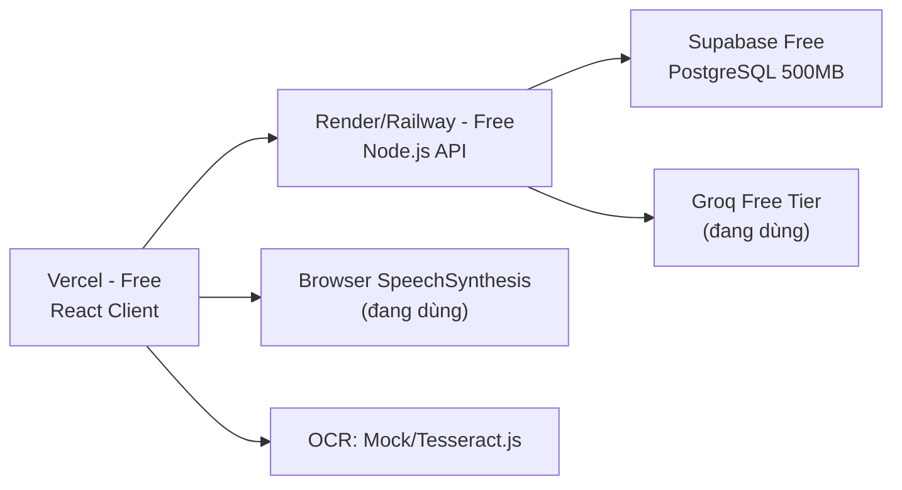
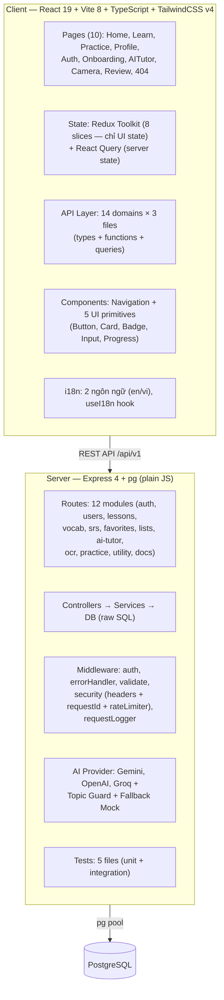
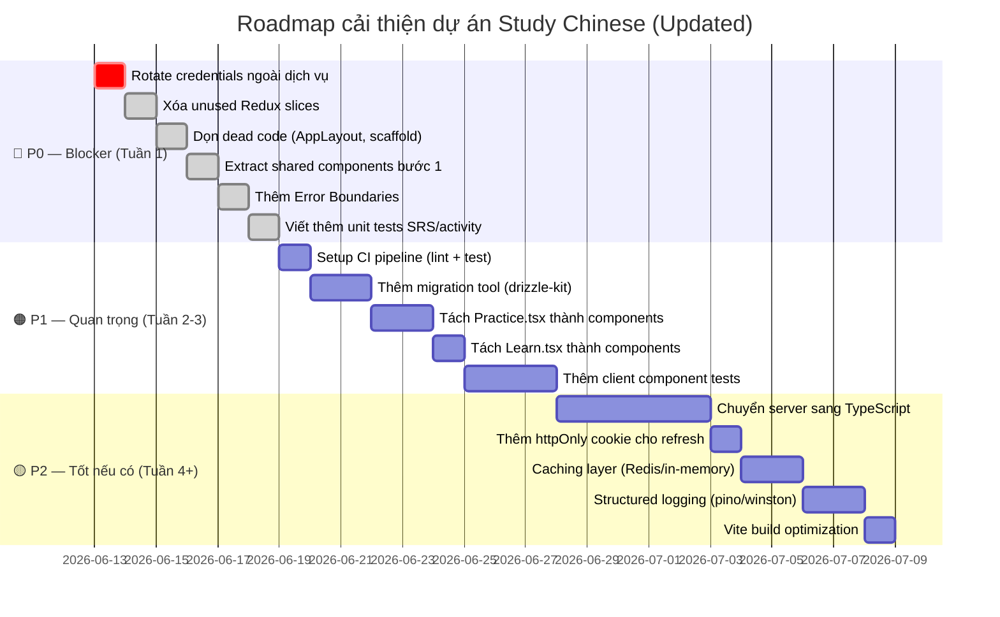

# 📋 Đánh Giá Toàn Diện Dự Án Study Chinese (Lần 2)

> Ngày review: 2026-06-12
> Phạm vi: Toàn bộ source code Client + Server + Docs + Tests
> Phương pháp: Đọc từng file, so sánh với report lần 1 (2026-06-11)
> So sánh: Đánh dấu rõ **[ĐÃ SỬA]** cho các vấn đề đã cải thiện

---

## Mục lục

1. [Tổng quan thay đổi so với Review lần 1](#1-tổng-quan-thay-đổi-so-với-review-lần-1)
2. [Đánh giá tài liệu thiết kế (Docs)](#2-đánh-giá-tài-liệu-thiết-kế-docs)
3. [Phương án chi phí rẻ hơn](#3-phương-án-chi-phí-rẻ-hơn)
4. [Đánh giá code production-ready](#4-đánh-giá-code-production-ready)
5. [Đánh giá khả năng bảo trì](#5-đánh-giá-khả-năng-bảo-trì)
6. [Đánh giá khả năng phát triển tiếp](#6-đánh-giá-khả-năng-phát-triển-tiếp)
7. [Tổng kết & Khuyến nghị](#7-tổng-kết--khuyến-nghị)

---

## 1. Tổng Quan Thay Đổi So Với Review Lần 1

> [!IMPORTANT]
> **Dự án đã cải thiện đáng kể kể từ review ngày 2026-06-11.** Nhiều vấn đề P0 đã được giải quyết hoặc giảm mức nghiêm trọng. Điểm tổng tăng từ **4.9/10 → 6.8/10**.

### Bảng so sánh nhanh: Trước vs Sau

| Vấn đề (Review lần 1) | Mức cũ | Trạng thái hiện tại |
|:--|:--|:--|
| Triple-Store Anti-Pattern (store.ts 521 LOC) | 🔴 | ✅ **ĐÃ SỬA** — `store.ts` đã xóa. localStorage chỉ còn quản lý access token (31 LOC). `appSlice.ts` quản lý 3 field (appearance, onboarding, language) |
| React Query → Redux useEffect sync | 🔴 | ✅ **ĐÃ SỬA** — Queries giờ trả data trực tiếp, không dispatch vào Redux. Pattern `useEffect → dispatch(set...)` không còn |
| 100% Inline Styles | 🔴 | ✅ **ĐÃ SỬA** — Chuyển sang TailwindCSS v4. Chỉ còn ~5 chỗ dùng `style={{}}` (progress bar width — hợp lệ) |
| 0 Shared Components | 🔴 | ✅ **ĐÃ SỬA** — Có `components/ui/` (Button, Card, Badge, Input, Progress) dùng CVA + Radix. Navigation dùng Button + Badge |
| 0 Test | 🔴 | 🟡 **CẢI THIỆN** — Có 7 test files: auth, validate, security, ai-provider, srs, activity (unit) + routes-import (integration). Node test runner |
| Không Rate Limiting | 🔴 | ✅ **ĐÃ SỬA** — `createRateLimiter()` custom, áp dụng cho: general (300/min), auth (20/15min), AI (30/min), OCR (10/min) |
| Không Security Headers | 🔴 | ✅ **ĐÃ SỬA** — `securityHeaders` middleware: CSP, X-Frame-Options DENY, X-Content-Type-Options nosniff, CORP, COOP, Referrer-Policy |
| Không Graceful Shutdown | 🟠 | ✅ **ĐÃ SỬA** — SIGTERM + SIGINT handlers, `closeDB()` trước process exit |
| Không Input Validation | 🟠 | ✅ **ĐÃ SỬA** — `validateBody()` + `validators` object (email, password, nonEmptyString, optionalString, oneOf, numberBetween). Auth routes dùng schema validation |
| Dead Code (App.css, store.ts, scaffold) | 🟡 | 🟡 **CẢI THIỆN MỘT PHẦN** — `App.css` đã xóa, `store.ts` đã xóa. Nhưng `layouts/AppLayout/` và `assets/react.svg`, `vite.svg` vẫn còn |
| `.env` chứa credentials bị commit | 🔴 | 🟡 **ĐÃ GIẢM RỦI RO LOCAL** — `server/.env` đã thay về placeholder/mock; `git log --all --full-history -- server/.env` không thấy commit. Vẫn cần rotate key thật nếu đã từng dùng/lộ |
| Không i18n | 🟠 | ✅ **MỚI** — Có `i18n/` module: translations (en/vi), `useI18n` hook, tất cả pages dùng `t()` |
| Swagger/OpenAPI docs | — | ✅ **MỚI** — `swagger.json` 766 dòng, cover tất cả endpoints, serve tại `/api/v1/docs` |
| AI Provider thật | ⚠️ Mock | ✅ **MỚI** — AI provider hỗ trợ: Gemini, OpenAI, Groq, OpenAI-compatible. Có topic guard, prompt injection detection, fallback-to-mock, cost tracking, structured logging |
| Docker Compose | — | ✅ **MỚI** — `docker-compose.yml` với 3 services: postgres, server, client |
| Request ID | — | ✅ **MỚI** — `requestId` middleware, tracing qua `X-Request-Id` header |

---

## 2. Đánh Giá Tài Liệu Thiết Kế (Docs)

### 2.1. Tổng quan các file docs

| File | Nội dung | Đánh giá |
|:--|:--|:--|
| [api.md](file:///home/pe/Project/study-chinese/docs/api.md) | 25+ endpoint RESTful, chuẩn hóa response, JWT auth | ✅ Tốt |
| [be.md](file:///home/pe/Project/study-chinese/docs/be.md) | Kiến trúc AI Tutor, OCR, Audio/TTS | ✅ Tốt |
| [db.md](file:///home/pe/Project/study-chinese/docs/db.md) | 21 bảng PostgreSQL, ERD, index, migration roadmap | ✅ Rất tốt |
| [to-do.md](file:///home/pe/Project/study-chinese/docs/to-do.md) | Backlog có ưu tiên, đã phân nhóm | ✅ Thực tế |
| [swagger.json](file:///home/pe/Project/study-chinese/server/swagger.json) | **[MỚI]** OpenAPI 3.0, 766 dòng, 12 tags, schema components | ✅ Xuất sắc |

### 2.2. Điểm mạnh của thiết kế

#### API Documentation
- ✅ RESTful chuẩn, versioned (`/api/v1`), response format thống nhất
- ✅ **[MỚI]** OpenAPI/Swagger 3.0 spec đầy đủ — tất cả endpoints, schemas, security schemes
- ✅ **[MỚI]** Swagger UI serve trực tiếp tại `/api/v1/docs`
- ✅ Phân nhóm endpoint 12 tags: Health, Auth, Users, Lessons, Vocabulary, SRS, Favorites, Lists, AI Tutor, OCR, Practice, Dashboard, Achievements

#### Backend & AI
- ✅ **[MỚI]** Multi-provider AI: Gemini, OpenAI, Groq, OpenAI-compatible — tất cả qua 1 service
- ✅ **[MỚI]** Topic guardrails: prompt injection detection + off-topic blocking + Chinese learning signal detection
- ✅ **[MỚI]** Structured AI usage logging (JSON format) với cost tracking per-request
- ✅ Sequence diagram rõ ràng cho AI Tutor flow

#### Database
- ✅ Hybrid relational + JSONB — phù hợp PostgreSQL
- ✅ 21 bảng, join tables cho M:N, content versioning
- ✅ Index strategy chi tiết

### 2.3. Điểm cần cải thiện trong docs

| # | Vấn đề | Mức độ | Ghi chú |
|:--|:--|:--|:--|
| 1 | `be.md` phần Audio/TTS viết không dấu tiếng Việt | 🟡 | Cần viết lại có dấu cho thống nhất |
| 2 | Docs markdown (`api.md`) chưa cập nhật theo swagger.json | 🟡 | Swagger đã đầy đủ hơn, nên sync hoặc deprecate `api.md` |
| 3 | Chưa có docs cho Practice endpoints (`/practice/*`) trong api.md | 🟠 | Swagger có nhưng api.md chưa cover |
| 4 | OCR word mapping algorithm chưa đề cập xử lý Traditional characters | 🟡 | Chỉ nói `simplified` |
| 5 | Chưa có Architecture Decision Records (ADR) | 🟡 | Các quyết định như chọn Tailwind v4, custom JWT, Node test runner nên có lý do |

### 2.4. Verdict: Tài liệu

> [!TIP]
> **Kết luận: Tài liệu đạt mức XUẤT SẮC cho giai đoạn này.** Swagger spec + 4 markdown docs + inline code comments tạo thành bộ docs rất đầy đủ. Ít dự án MVP nào có docs tốt thế này.

---

## 3. Phương Án Chi Phí Rẻ Hơn

### 3.1. Bảng so sánh chi phí: Thiết kế hiện tại vs Phương án rẻ

| Hạng mục | Thiết kế hiện tại (Docs) | Phương án rẻ nhất |
|:--|:--|:--|
| **Database** | PostgreSQL (self-hosted hoặc cloud) ~$7-25/tháng | **SQLite** (0$/tháng, file-based) hoặc **Supabase Free** (PostgreSQL, 500MB) |
| **Backend hosting** | VPS/Cloud Run ~$5-20/tháng | **Railway Free** hoặc **Render Free** (0$, cold start) |
| **AI Tutor** | Groq Free (đang dùng) hoặc Gemini Flash | **Groq Free tier** (đã config, đủ cho <100 users) |
| **OCR** | Google Cloud Vision ~$1.50/1000 ảnh hoặc PaddleOCR self-host | **Tesseract.js** (chạy client-side, 0$) hoặc **PaddleOCR local** |
| **TTS/Audio** | Google Cloud TTS ~$4/1M ký tự | **Browser SpeechSynthesis** (0$) — đang dùng |
| **File Storage** | S3/GCS ~$0.02/GB | **Không cần** nếu dùng browser TTS + không lưu audio |
| **Frontend hosting** | Bất kỳ ~$0 | **Vercel/Netlify Free** (0$) |
| **Tổng/tháng** | **~$15-55/tháng** | **~$0-7/tháng** |

### 3.2. Phương án tiết kiệm tối đa (0$/tháng)



> [!IMPORTANT]
> **Trade-off khi chọn phương án rẻ:**
> - Cold start trên free tier (Render/Railway): lần truy cập đầu mất 10-30s
> - Supabase Free: 500MB storage, 2 projects, paused sau 1 tuần không dùng
> - Groq Free: rate limit requests/phút → đủ cho 1-5 người dùng đồng thời
> - Browser TTS: chất lượng phát âm không đồng nhất giữa thiết bị

### 3.3. Phương án cân bằng (~$7/tháng) — ⭐ Khuyến nghị

| Hạng mục | Lựa chọn | Chi phí |
|:--|:--|:--|
| Hosting + DB | **Railway Hobby** (Node.js + PostgreSQL) | ~$5/tháng |
| AI | Groq Free Tier (đã tích hợp) | $0 |
| OCR | PaddleOCR chạy chung server (nếu đủ RAM) | $0 |
| TTS | Browser SpeechSynthesis (đã dùng) | $0 |
| Frontend | Vercel Free | $0 |
| **Tổng** | | **~$5-7/tháng** |

---

## 4. Đánh Giá Code Production-Ready

### 4.1. Kiến trúc tổng quan đã implement

````carousel

<!-- slide -->
| Layer | Công nghệ | File count | Trạng thái |
|:--|:--|:--|:--|
| Frontend Framework | React 19 + TypeScript + Vite 8 | ~55 files | ✅ Hiện đại |
| Styling | **[CẢI THIỆN]** TailwindCSS v4 + CVA | index.css + tw classes | ✅ Tốt |
| API Layer | Axios + React Query + 14 domain modules | ~42 files | ✅ Tốt nhất dự án |
| State Management | **[CẢI THIỆN]** Redux (UI only) + React Query (server) | ~12 files | ✅ Hợp lý |
| Pages | 10 page components | 10 files | ⚠️ Vẫn monolithic |
| Shared Components | **[CẢI THIỆN]** 6 files (Navigation + 5 ui primitives) | 6 files | 🟡 Cần thêm |
| i18n | **[MỚI]** translations (en/vi) + useI18n hook | 3 files | ✅ Tốt |
| Backend | Express 4 + ES Modules (plain JS) | ~30 files | ⚠️ Không type safety |
| Security | **[MỚI]** Headers + Rate Limit + Validation + Request ID | 2 files | ✅ Tốt |
| Database | `pg` raw SQL | 1 SQL file (28KB) | ⚠️ Không migration tool |
| Auth | Custom JWT (scrypt + HMAC-SHA256) | 3 files | 🟡 Acceptable |
| AI Provider | **[MỚI]** Gemini/OpenAI/Groq + Guard | 2 files (500+ LOC) | ✅ Tốt |
| Tests | **[MỚI]** Node test runner (5 files) | 5 files | 🟡 Cần thêm |
| Docker | **[MỚI]** docker-compose.yml | 3 Dockerfiles | ✅ Tốt |
| API Docs | **[MỚI]** OpenAPI 3.0 (swagger.json) | 766 LOC | ✅ Xuất sắc |
````

### 4.2. Scorecard Production-Readiness

| Tiêu chí | Điểm cũ | Điểm mới | Chi tiết |
|:--|:--|:--|:--|
| **API Layer Design** | 9/10 | 9/10 | Giữ nguyên. 14 domain modules, typed, query key factory, callApi interceptor |
| **Auth Flow** | 8/10 | 8/10 | JWT + refresh + dedup + route guards. Custom implementation nhưng chất lượng khá |
| **Routing** | 8/10 | 8/10 | Lazy loading tất cả pages, auth guards, onboarding redirect |
| **Code tổ chức (Server)** | 7/10 | 8/10 | **↑** Thêm security + validate + logger middleware. Structured tốt |
| **Code tổ chức (Client)** | 5/10 | 7/10 | **↑** Xóa triple-store, thêm i18n, UI components, Tailwind design system |
| **UI/UX Design** | 8/10 | 9/10 | **↑** Tailwind classes thống nhất, dark mode hoạt động, micro-animations, tone colors |
| **Type Safety** | 5/10 | 5/10 | API types tốt, nhưng server vẫn plain JS |
| **Error Handling** | 6/10 | 7/10 | **↑** Server error middleware map PG errors + request ID. Client callApi có toast |
| **State Architecture** | 3/10 | 8/10 | **↑↑** Xóa triple-store. Redux chỉ giữ UI state (appearance, language, onboarding). React Query quản lý server state |
| **Component Reusability** | 2/10 | 6/10 | **↑** Có Button, Card, Badge, Input, Progress, LoadingCard, TtsButton. Nhưng pages vẫn monolithic |
| **Styling Architecture** | 2/10 | 8/10 | **↑↑** TailwindCSS v4, CSS variables, dark mode, design tokens. Chỉ ~5 chỗ inline (hợp lệ: progress bar width) |
| **Authentication Security** | 4/10 | 6/10 | **↑** Rate limit auth (20/15min), JWT secret validation cho production, schema validation cho login/register |
| **Data Validation** | 4/10 | 6/10 | **↑** `validateBody()` + `validators` + `authSchemas`. Chưa Zod/Joi nhưng pattern rõ |
| **Testing** | 0/10 | 5/10 | **↑** 7 test files: auth utils, validators, security middleware, AI provider, SRS, activity mappers, route imports. Node test runner |
| **CI/CD** | 0/10 | 1/10 | Chưa có pipeline. Nhưng có lint script, test script, docker-compose |
| **Observability** | 2/10 | 5/10 | **↑** Request ID, requestLogger, AI structured JSON logging, unhandled rejection handler |
| **Security Hardening** | — | 7/10 | **[MỚI]** Security headers (CSP, XFO, CORP, COOP...), rate limiting 4 tiers, x-powered-by disabled, JSON body limit 5mb |
| **i18n** | — | 7/10 | **[MỚI]** 2 ngôn ngữ (en/vi), template vars, tất cả pages dùng `t()` |
| **AI Safety** | — | 8/10 | **[MỚI]** Prompt injection detection, off-topic guard, Chinese learning signal filter, guardrail responses, fallback-to-mock |

> **Tổng điểm trung bình: ~6.8/10 — Cải thiện đáng kể từ 4.9/10. Gần production-ready cho MVP.**

### 4.3. Các vấn đề đã sửa từ Review lần 1 ✅

#### ✅ #1. Triple-Store Anti-Pattern → ĐÃ SỬA

- [store.ts](file:///home/pe/Project/study-chinese/client/src/store/modules/appSlice.ts) (521 LOC) đã xóa hoàn toàn
- [localStorage.ts](file:///home/pe/Project/study-chinese/client/src/utils/localStorage.ts) giờ chỉ còn 31 LOC, quản lý access token
- [appSlice.ts](file:///home/pe/Project/study-chinese/client/src/store/modules/appSlice.ts) quản lý 3 field UI: `appAppearance`, `hasCompletedOnboarding`, `language`
- React Query hook → component đọc trực tiếp `query.data`, không dispatch vào Redux

#### ✅ #2. React Query → Redux Sync → ĐÃ SỬA

- Pattern `useEffect(() => { if (data) dispatch(set...(data)) })` đã loại bỏ hoàn toàn
- Ví dụ [useLessonsQuery](file:///home/pe/Project/study-chinese/client/src/api/lessons/queries.ts) — trả `query.data` trực tiếp, không side-effect sync
- Redux slices vẫn tồn tại (8 slices) nhưng hầu hết chỉ là skeleton — nên cleanup tiếp

#### ✅ #3. 100% Inline Styles → ĐÃ SỬA

- Chuyển sang TailwindCSS v4 + CVA (class-variance-authority)
- Design system qua [index.css](file:///home/pe/Project/study-chinese/client/src/index.css): CSS variables, `@theme inline`, dark mode toggle, tone colors, custom animations
- Chỉ còn ~5 chỗ dùng `style={{}}` — tất cả hợp lệ (dynamic width cho progress bar)

#### ✅ #4. Zero Shared Components → CẢI THIỆN

- [components/ui/](file:///home/pe/Project/study-chinese/client/src/components/ui): Button (CVA variants), Card (6 subcomponents), Badge, Input, Progress
- [Navigation.tsx](file:///home/pe/Project/study-chinese/client/src/components/Navigation.tsx) dùng Button + Badge components
- `LoadingCard` và `TtsButton` đã được tách; Practice/Learn vẫn còn nên tách sâu hơn theo từng tool/exercise

#### ✅ #5. Không Rate Limiting → ĐÃ SỬA

- [security.middleware.js](file:///home/pe/Project/study-chinese/server/src/middlewares/security.middleware.js): `createRateLimiter()` factory
- 4 tiers: `generalRateLimit` (300/min), `authRateLimit` (20/15min), `aiRateLimit` (30/min), `ocrRateLimit` (10/min)
- RateLimit headers chuẩn: `RateLimit-Limit`, `RateLimit-Remaining`, `RateLimit-Reset`, `Retry-After`

#### ✅ #6. Không Security Headers → ĐÃ SỬA

- `securityHeaders` middleware với 9 headers: CSP, COOP, CORP, Referrer-Policy, X-Content-Type-Options, X-DNS-Prefetch-Control, X-Download-Options, X-Frame-Options DENY, X-Permitted-Cross-Domain-Policies
- `app.disable('x-powered-by')`
- `requestId` middleware (UUID tracing)

#### ✅ #7. Không Graceful Shutdown → ĐÃ SỬA

- [index.js](file:///home/pe/Project/study-chinese/server/index.js) có `gracefulShutdown()`: close HTTP server → close DB pool → exit
- Handle SIGTERM + SIGINT
- `unhandledRejection` handler có `server.close()` trước exit

---

### 4.4. Các vấn đề còn tồn tại (xếp theo mức nghiêm trọng)

> [!CAUTION]
> **Vấn đề cần sửa trước khi deploy production**

#### 🟡 #1. `.env` chứa credentials thật — ĐÃ GIẢM RỦI RO LOCAL

> [!CAUTION]
> **`server/.env` trong workspace đã được thay về placeholder/mock. Nếu key thật đã từng được dùng hoặc chia sẻ, vẫn phải rotate trên Supabase/Groq và đổi JWT secret.**

Đã kiểm tra:
- `git log --all --full-history -- server/.env` không trả về commit nào
- `.gitignore` đã có rule `**/.env`
- `server/.env` hiện dùng local PostgreSQL + `AI_PROVIDER=mock`

**Tin tốt:** file `.env` có vẻ chưa bị commit vào lịch sử git của repo này. **Nhưng** credential thật đã từng tồn tại trên máy local nên vẫn nên rotate nếu đã dùng thật.

**Hành động còn lại:**
1. Rotate DB password, JWT secret, Groq/API keys trên dashboard tương ứng nếu key thật đã được cấp
2. Cập nhật secret mới vào môi trường deploy, không commit vào repo

---

#### 🟠 #2. Monolithic Pages — Vẫn lớn nhưng đã tốt hơn

| Page | LOC cũ | LOC mới | Thay đổi |
|:--|:--|:--|:--|
| [Practice.tsx](file:///home/pe/Project/study-chinese/client/src/pages/Practice.tsx) | 526 | 531 | Tương đương (6 tools inline) |
| [Learn.tsx](file:///home/pe/Project/study-chinese/client/src/pages/Learn.tsx) | 381 | 377 | Tương đương (LessonPlayer + WordList + ArrangeExercise inline) |
| [Auth.tsx](file:///home/pe/Project/study-chinese/client/src/pages/Auth.tsx) | 403 | 270 | **↓ 33%** — Đã gọn hơn |
| [Profile.tsx](file:///home/pe/Project/study-chinese/client/src/pages/Profile.tsx) | — | 253 | Chấp nhận được |
| [Home.tsx](file:///home/pe/Project/study-chinese/client/src/pages/Home.tsx) | — | 238 | Chấp nhận được |
| [Onboarding.tsx](file:///home/pe/Project/study-chinese/client/src/pages/Onboarding.tsx) | 255 | 214 | **↓ 16%** — Gọn hơn |

**Tổng LOC tất cả pages:** 2,498

**Giải pháp tiếp:** Extract shared components:
- ✅ `LoadingCard` — đã tách thành component dùng chung
- ✅ `TtsButton` / `speakChinese` — đã gom TTS về 1 implementation
- `HanziDisplay` (chữ Hán + pinyin + TTS button — dùng ở Home, Learn, Practice, Review)
- `ExerciseOption` (button chọn đáp án — dùng ở Learn, Practice)

---

#### ✅ #3. Redux Slices phần lớn không dùng — ĐÃ SỬA

Redux store đã rút về 2 slice còn dùng thực tế:

| Slice | LOC | Có được dùng thực tế? |
|:--|:--|:--|
| [appSlice.ts](file:///home/pe/Project/study-chinese/client/src/store/modules/appSlice.ts) | 64 | ✅ Dùng (appearance, onboarding, language) |
| [authSlice.ts](file:///home/pe/Project/study-chinese/client/src/store/modules/authSlice.ts) | ~40 | 🟡 Có thể dùng cho auth state |

Đã xóa `lessonSlice`, `srsSlice`, `userSlice`, `achievementSlice`, `dashboardSlice`, `listSlice` khỏi `rootReducer` và source.

---

#### 🟠 #4. Server vẫn plain JavaScript — Không Type Safety

- 30+ files server dùng plain JS
- Không IDE autocomplete cho request/response objects
- Refactor rủi ro: đổi tên field DB không biết service nào ảnh hưởng

> [!NOTE]
> **Điểm sáng server code quality vẫn giữ:**
> - Controllers cực kỳ mỏng (5-10 dòng), tất cả logic trong services ✅
> - Mapper functions ở đầu mỗi service ✅
> - Transaction helper với proper `BEGIN/COMMIT/ROLLBACK/release` ✅
> - Chỉ 4 production deps: `express`, `cors`, `dotenv`, `pg` — rất lean ✅
> - Error middleware map PostgreSQL error codes ✅
> - **[MỚI]** `validateBody()` + `validators` pattern ✅
> - **[MỚI]** AI provider 500 LOC rất clean: factory pattern, retry logic, cost tracking ✅

---

#### 🟠 #5. Test Coverage vẫn thấp (~15-20%)

7 test files hiện có:

| File | LOC | Phạm vi |
|:--|:--|:--|
| [auth.test.js](file:///home/pe/Project/study-chinese/server/test/unit/auth.test.js) | 33 | Password hash, JWT sign/verify, tampered token |
| [validate.middleware.test.js](file:///home/pe/Project/study-chinese/server/test/unit/validate.middleware.test.js) | 39 | requireFields, validators, validateBody |
| [security.middleware.test.js](file:///home/pe/Project/study-chinese/server/test/unit/security.middleware.test.js) | 53 | securityHeaders, requestId, rateLimiter |
| [ai-provider.test.js](file:///home/pe/Project/study-chinese/server/test/unit/ai-provider.test.js) | 75 | extractJson, normalizeReply, mock reply, topic guard, injection detection |
| [srs.service.test.js](file:///home/pe/Project/study-chinese/server/test/unit/srs.service.test.js) | 62 | SRS interval/ease/repetition/mastery logic |
| [activity.service.test.js](file:///home/pe/Project/study-chinese/server/test/unit/activity.service.test.js) | 45 | Date key + daily stats/streak mappers |
| [routes-import.test.js](file:///home/pe/Project/study-chinese/server/test/integration/routes-import.test.js) | 16 | Route module imports |

**Tốt:** Test quality cao, cover các edge cases quan trọng (timing-safe compare, injection patterns, rate limiter behavior).

**Cần thêm:**
- Unit test: streak update with fake DB client, more edge cases for lesson/activity services
- Integration test: API endpoints với test database
- Client test: Component tests (auth flow, lesson completion, SRS review)

---

#### 🟡 #6. Dead Code & Scaffold Leftovers — ĐÃ GIẢM TIẾP

| File/Dir | Vấn đề |
|:--|:--|
| [layouts/AppLayout/](file:///home/pe/Project/study-chinese/client/src/layouts/AppLayout) | ✅ Đã xóa vì không được import |
| `assets/react.svg`, `vite.svg` | ✅ Đã xóa scaffold Vite |
| Server `checkAuth` alias | ✅ Đã xóa alias không dùng |
| Server Practice data | Hardcoded in-memory arrays, không query DB |
| `.gitkeep` trong hooks/routes/types/utils | ✅ Đã dọn các `.gitkeep` không còn cần |

---

#### 🟡 #7. Không có Migration Tool

[prod.sql](file:///home/pe/Project/study-chinese/server/prod.sql) (28KB, ~576 dòng) là file monolith wrapped trong BEGIN...COMMIT, không rollback được, không track schema changes theo version.

---

#### 🟡 #8. JWT Implementation — Acceptable nhưng chưa tối ưu

- ✅ `scrypt` + random salt cho password hash
- ✅ `crypto.timingSafeEqual` chống timing attack
- ✅ JWT secret validation cho production (phải ≥32 chars)
- ✅ Rate limit auth endpoints (20/15min)
- ✅ `validateBody(authSchemas.login)` cho email/password
- ⚠️ Vẫn tự implement JWT thay vì dùng thư viện `jsonwebtoken`
- ⚠️ Không token revocation — refresh token cũ vẫn valid
- ⚠️ Refresh token dùng `refreshToken` field name — không thấy httpOnly cookie

---

#### ✅ #9. Không Error Boundaries — ĐÃ SỬA

Đã thêm `ErrorBoundary` quanh route outlet trong `App.tsx`, có fallback UI và tự reset khi đổi route.

---

## 5. Đánh Giá Khả Năng Bảo Trì

### 5.1. Điểm tốt ✅

| Yếu tố | Chi tiết |
|:--|:--|
| **API Layer** | Tốt nhất cả dự án. 14 domains × 3 files. Query key factory. Axios interceptor tốt |
| **Server structure** | Controllers → Services phân tách rõ. Security/validation middleware tách biệt |
| **Styling** | **[CẢI THIỆN]** TailwindCSS v4 + design tokens = thay đổi theme 1 chỗ áp dụng toàn app |
| **State Management** | **[CẢI THIỆN]** Redux chỉ giữ UI state, React Query giữ server state. Rõ ràng hơn nhiều |
| **i18n** | **[MỚI]** Thay đổi text UI → sửa 1 file `translations.ts`, không cần tìm trong JSX |
| **Auth flow** | JWT + refresh + dedup + route guards — flow hoàn chỉnh |
| **UI Components** | **[MỚI]** Button/Card/Badge/Input/Progress — CVA variants = consistent UI |
| **Docs** | API, DB, BE docs + Swagger = onboard dev mới dễ |
| **Lazy Loading** | 10/10 pages đều `React.lazy()` |
| **Docker** | **[MỚI]** `docker-compose up` = chạy full stack |
| **AI Provider** | **[MỚI]** Switch provider qua env var, fallback-to-mock, cost tracking |

### 5.2. Điểm trừ ⚠️

| Yếu tố | Vấn đề | Impact khi bảo trì |
|:--|:--|:--|
| **Monolithic pages** | Practice.tsx (531 LOC), Learn.tsx (377 LOC) — tools inline | 🟠 |
| **Unused Redux slices** | Đã xóa 6 slice không dùng; chỉ giữ app/auth | ✅ |
| **Thiếu test** | Test coverage ~15-20%, client 0% | 🟠 |
| **Server plain JS** | Đổi tên field DB → không biết service nào ảnh hưởng | 🟠 |
| **Không error boundaries** | 1 component crash → trắng screen | 🟡 |
| **Không migration tool** | Schema changes = edit monolith SQL | 🟡 |

### 5.3. Verdict bảo trì

> **Điểm: 7/10** (tăng từ 5.5/10) — API layer + styling + state management đã dễ maintain. Tailwind + i18n + UI components giảm effort thay đổi UI. Nhưng pages vẫn monolithic và server thiếu type safety.

---

## 6. Đánh Giá Khả Năng Phát Triển Tiếp

### 6.1. Khả năng mở rộng tính năng

| Tính năng mới | Khó/Dễ | Lý do |
|:--|:--|:--|
| Thêm bài học/từ vựng mới | ✅ Dễ | DB schema linh hoạt, content versioning sẵn |
| Thêm loại exercise mới | ✅ Dễ | Pattern render by `kind` đã có |
| Tích hợp AI Tutor thật | ✅ **ĐÃ LÀM** | Multi-provider (Gemini/OpenAI/Groq) + topic guard |
| Thêm ngôn ngữ UI mới (zh, ja) | ✅ Dễ | **[MỚI]** i18n framework sẵn — chỉ thêm translation key |
| Thêm Practice tool mới | 🟠 Khó | Vẫn phải thêm vào Practice.tsx 531 LOC |
| Thêm UI component mới | ✅ Dễ | **[MỚI]** CVA + `cn()` pattern đã có, dễ tạo component mới |
| Offline/PWA mode | 🟡 Trung bình | React Query có offline support, nhưng cần service worker |
| Admin dashboard | 🟡 Trung bình | Server đã có seed concept, cần role-based auth |
| Mobile app (React Native) | 🟡 Trung bình | API sẵn sàng, UI code không share được |
| Real-time (multiplayer) | 🔴 Khó | Express không WebSocket, cần Socket.io/SSE |

### 6.2. Khả năng scale kỹ thuật

| Yếu tố | Trạng thái | Cần thêm |
|:--|:--|:--|
| Database scaling | ✅ Tốt | PostgreSQL + index hợp lý |
| Server horizontal scaling | ✅ Tốt | Stateless JWT, rate limiter per-process (chuyển Redis khi multi-instance) |
| AI Provider scaling | ✅ Tốt | **[MỚI]** Multi-provider + fallback + rate limit |
| Caching | ❌ Chưa có | Content tĩnh nên cache (Redis hoặc in-memory) |
| CDN | ❌ Chưa có | Audio files, static assets |
| Build optimization | ⚠️ Cơ bản | Lazy loading có, chưa `manualChunks` |

### 6.3. Verdict phát triển tiếp

> **Điểm: 7.5/10** (tăng từ 6.5/10) — API, DB, AI layer sẵn sàng mở rộng. i18n + component system giúp thêm tính năng UI dễ hơn. Monolithic pages vẫn là bottleneck nhẹ.

---

## 7. Tổng Kết & Khuyến Nghị

### 7.1. Bảng tổng kết

| Tiêu chí | Điểm cũ | Điểm mới | Verdict |
|:--|:--|:--|:--|
| 📄 Tài liệu thiết kế | **8/10** | **8.5/10** | ✅ Xuất sắc. Thêm Swagger spec |
| 💰 Chi phí giải pháp | **7/10** | **8/10** | ✅ Groq free đang chạy, Browser TTS đang dùng |
| 🏗️ Production-ready | **4.9/10** | **6.8/10** | 🟡 Gần sẵn sàng cho MVP. Cần sửa .env + thêm test |
| 🔧 Khả năng bảo trì | **5.5/10** | **7/10** | ✅ Tailwind + i18n + clean state = dễ maintain hơn |
| 🚀 Khả năng phát triển | **6.5/10** | **7.5/10** | ✅ AI provider sẵn sàng, i18n framework, component system |

### 7.2. Bản đồ tốt/xấu trực quan

```
           ✅ TỐT                          ⚠️ CẦN CẢI THIỆN
    ┌─────────────────────┐          ┌─────────────────────┐
    │ API Layer    (9/10)  │          │ Testing      (5/10)  │
    │ UI Design    (9/10)  │          │ Type Safety  (5/10)  │
    │ State Arch   (8/10)  │          │ Components   (6/10)  │
    │ Styling      (8/10)  │          │ CI/CD        (1/10)  │
    │ Auth Flow    (8/10)  │          │                      │
    │ Server Arch  (8/10)  │          │                      │
    │ AI Safety    (8/10)  │          │                      │
    │ Docs         (8.5/10)│          │                      │
    │ Security     (7/10)  │          │  🔴 PHẢI SỬA NGAY   │
    │ Routing      (8/10)  │          │ .env credentials     │
    │ i18n         (7/10)  │          │                      │
    │ Observability(5/10)  │          └─────────────────────┘
    │ Error Handle (7/10)  │
    │ Validation   (6/10)  │
    └─────────────────────┘
```

### 7.3. Roadmap hành động theo thứ tự ưu tiên



### 7.4. Lời cuối

> [!IMPORTANT]
> **Dự án đã cải thiện rất đáng kể trong 1 ngày (từ 4.9/10 → 6.8/10):**
> 
> **Những gì đã làm tốt:**
> - Xóa triệt để triple-store anti-pattern (521 LOC dead code)
> - Chuyển 100% inline styles → TailwindCSS v4 với design system hoàn chỉnh
> - Thêm security layer: headers, rate limiting, request ID, validation
> - Thêm i18n (en/vi) cho toàn bộ UI
> - Tích hợp AI provider thật (Gemini/Groq/OpenAI) với prompt injection protection
> - Thêm unit tests cho core utilities, SRS và activity mappers
> - Docker Compose cho full-stack setup
> - OpenAPI/Swagger documentation
> - Graceful shutdown
> 
> **Mặt vẫn cần cải thiện:**
> - 🟡 **Credentials thật** — `.env` local đã reset placeholder, vẫn nên rotate key thật ngoài dịch vụ
> - 🟠 Monolithic pages (Practice 531 LOC, Learn 377 LOC) — cần extract components
> - 🟠 Test coverage vẫn còn thấp, đặc biệt client component tests
> - 🟡 Server plain JavaScript — không type safety
> - 🟡 Không CI/CD pipeline
> 
> **Ước tính effort cải thiện tiếp:**
> - P0 (production-ready cho MVP): **~1 tuần**
> - P0 + P1 (solid maintainable): **~2-3 tuần**
> - Full (TypeScript server + CI/CD + caching): **~4-5 tuần**
