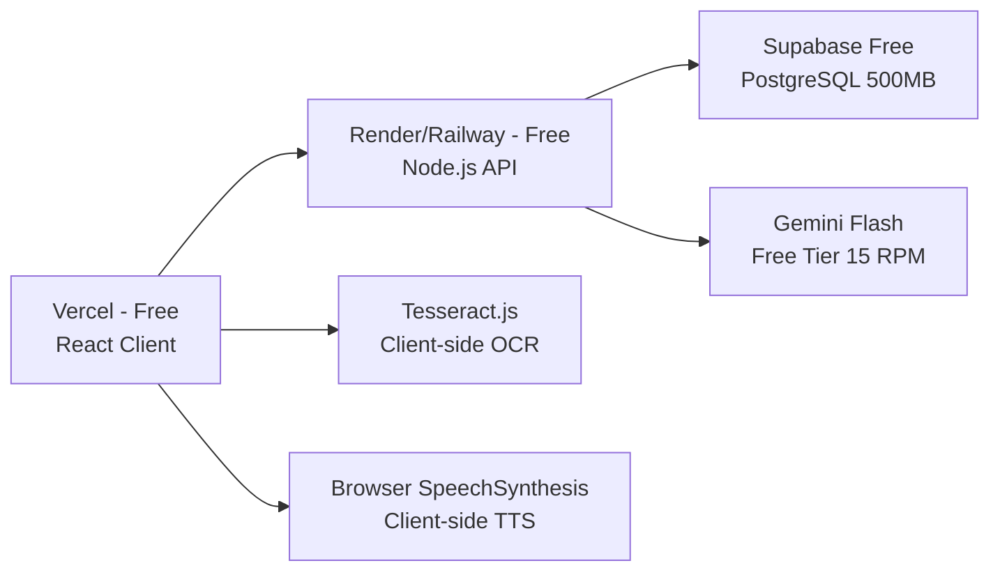
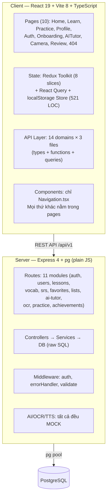
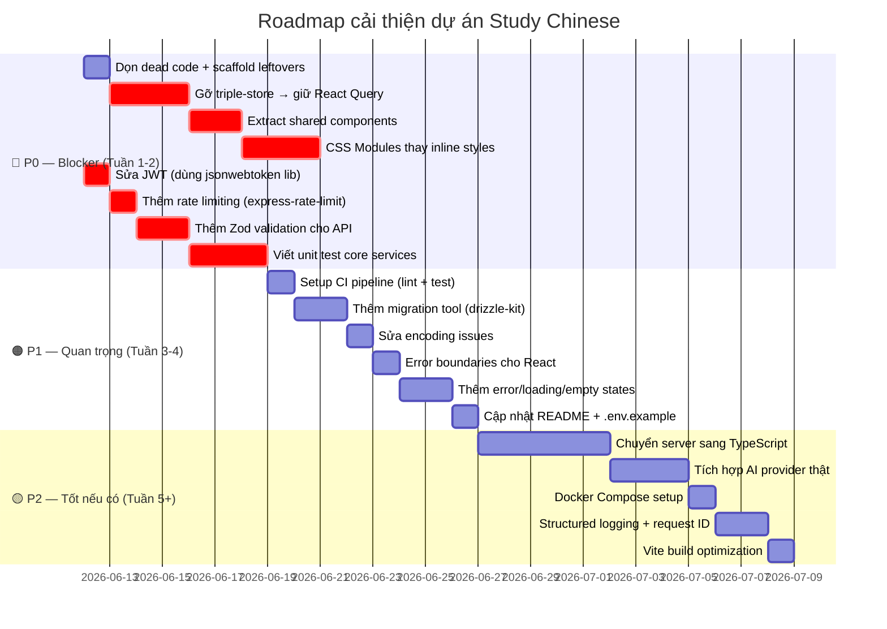

# 📋 Đánh Giá Toàn Diện Dự Án Study Chinese

> Ngày review: 2026-06-11  
> Phạm vi: Docs kiến trúc + Code thực tế (Client + Server)  
> Phương pháp: Đọc toàn bộ docs + review từng file source code

---

## Mục lục

1. [Đánh giá tài liệu thiết kế (Docs)](#1-đánh-giá-tài-liệu-thiết-kế-docs)
2. [Phương án chi phí rẻ hơn](#2-phương-án-chi-phí-rẻ-hơn)
3. [Đánh giá code production-ready](#3-đánh-giá-code-production-ready)
4. [Đánh giá khả năng bảo trì](#4-đánh-giá-khả-năng-bảo-trì)
5. [Đánh giá khả năng phát triển tiếp](#5-đánh-giá-khả-năng-phát-triển-tiếp)
6. [Tổng kết & Khuyến nghị](#6-tổng-kết--khuyến-nghị)

---

## 1. Đánh Giá Tài Liệu Thiết Kế (Docs)

### 1.1. Tổng quan các file docs

| File | Nội dung | Đánh giá |
|:--|:--|:--|
| [api.md](file:///d:/Project/study-chinese/docs/api.md) | 25+ endpoint RESTful, chuẩn hóa response, JWT auth | ✅ Tốt |
| [be.md](file:///d:/Project/study-chinese/docs/be.md) | Kiến trúc AI Tutor, OCR, Audio/TTS | ✅ Tốt |
| [db.md](file:///d:/Project/study-chinese/docs/db.md) | 21 bảng PostgreSQL, ERD, index, migration roadmap | ✅ Rất tốt |
| [to-do.md](file:///d:/Project/study-chinese/docs/to-do.md) | Backlog có ưu tiên, đã phân nhóm | ✅ Thực tế |

### 1.2. Điểm mạnh của thiết kế

#### API Design (`api.md`)
- ✅ RESTful chuẩn, versioned (`/api/v1`), response format thống nhất (`success/fail/error`)
- ✅ Phân nhóm endpoint logic: Auth → User → Lessons → SRS → Favorites → AI → OCR → Achievements
- ✅ Mỗi endpoint có request/response example rõ ràng, dễ implement

#### Backend & AI (`be.md`)
- ✅ Sequence diagram rõ ràng cho AI Tutor flow
- ✅ Gemini Flash là lựa chọn hợp lý: nhanh, rẻ, structured output tốt
- ✅ Có system prompt + JSON schema cụ thể → giảm thiểu sai lệch output LLM
- ✅ OCR có 2 phương án (Cloud vs Self-host) với trade-off rõ ràng
- ✅ Audio/TTS thiết kế cache-first, có batch pre-generate cho seed content

#### Database (`db.md`)
- ✅ Hybrid relational + JSONB — lựa chọn đúng cho PostgreSQL
- ✅ 21 bảng là con số hợp lý, không quá chuẩn hóa cũng không quá phẳng
- ✅ Join table thay array cho quan hệ M:N (`lesson_words`, `custom_list_words`) — đúng chuẩn production
- ✅ Content versioning (`content_releases`) — nhìn xa cho việc update content không phá progress cũ
- ✅ Index strategy chi tiết, có `pg_trgm` cho full-text search
- ✅ Migration roadmap 4 phase thực tế

### 1.3. Điểm cần cải thiện trong docs

| # | Vấn đề | Mức độ | Ghi chú |
|:--|:--|:--|:--|
| 1 | `be.md` phần Audio/TTS viết không dấu tiếng Việt | 🟡 | Cần viết lại có dấu cho thống nhất |
| 2 | Thiếu docs cho Practice endpoints (`/practice/*`) | 🟠 | Client đang gọi nhưng API docs không mô tả |
| 3 | Thiếu docs cho `/auth/refresh` | 🟠 | Code có nhưng docs chưa cover |
| 4 | Chưa có Rate Limiting spec | 🔴 | Critical cho production, đặc biệt AI/OCR endpoints |
| 5 | Chưa có Pagination spec | 🟠 | `GET /vocab`, `GET /lessons` sẽ cần khi data lớn |
| 6 | OCR word mapping algorithm chưa đề cập xử lý ký tự Traditional | 🟡 | Chỉ nói `simplified`, thiếu `traditional` matching |

### 1.4. Verdict: Tài liệu có hợp lý không?

> [!TIP]
> **Kết luận: Thiết kế tổng thể HỢP LÝ và đạt mức TRÊN TRUNG BÌNH cho một dự án ở giai đoạn này.**

Các lựa chọn kiến trúc (PostgreSQL, Gemini Flash, structured JSON output, SRS SuperMemo-2, content versioning) đều có cơ sở kỹ thuật vững. Tài liệu có chiều sâu và thực tế, không phải "copy template".

---

## 2. Phương Án Chi Phí Rẻ Hơn

### 2.1. Bảng so sánh chi phí: Thiết kế hiện tại vs Phương án rẻ

| Hạng mục | Thiết kế hiện tại (Docs) | Phương án rẻ nhất |
|:--|:--|:--|
| **Database** | PostgreSQL (self-hosted hoặc cloud) ~$7-25/tháng | **SQLite** (0$/tháng, file-based) hoặc **Supabase Free** (PostgreSQL, 500MB) |
| **Backend hosting** | VPS/Cloud Run ~$5-20/tháng | **Railway Free** hoặc **Render Free** (0$, cold start) |
| **AI Tutor** | Gemini Flash API ~$0-5/tháng (free tier: 15 RPM) | **Gemini Flash Free tier** (đủ cho <100 users) hoặc **Groq Free** |
| **OCR** | Google Cloud Vision ~$1.50/1000 ảnh hoặc PaddleOCR self-host | **Tesseract.js** (chạy client-side, 0$) hoặc **PaddleOCR local** |
| **TTS/Audio** | Google Cloud TTS ~$4/1M ký tự | **Browser SpeechSynthesis** (0$) hoặc **Edge TTS** (free, unofficial) |
| **File Storage** | S3/GCS ~$0.02/GB | **Không cần** nếu dùng browser TTS + không lưu audio |
| **Frontend hosting** | Bất kỳ ~$0 | **Vercel/Netlify Free** (0$) |
| **Tổng/tháng** | **~$15-55/tháng** | **~$0-7/tháng** |

### 2.2. Phương án tiết kiệm tối đa (0$/tháng)



> [!IMPORTANT]
> **Trade-off khi chọn phương án rẻ:**
> - Cold start trên free tier (Render/Railway): lần truy cập đầu mất 10-30s
> - Supabase Free: 500MB storage, 2 projects, paused sau 1 tuần không dùng
> - Gemini Free: 15 requests/phút → đủ cho 1-5 người dùng đồng thời
> - Tesseract.js: chất lượng OCR chữ Hán kém hơn Google Vision đáng kể
> - Browser TTS: chất lượng phát âm không đồng nhất giữa thiết bị

### 2.3. Phương án cân bằng (~$7/tháng) — ⭐ Khuyến nghị

| Hạng mục | Lựa chọn | Chi phí |
|:--|:--|:--|
| Hosting + DB | **Railway Hobby** (Node.js + PostgreSQL) | ~$5/tháng |
| AI | Gemini Flash Free Tier | $0 |
| OCR | PaddleOCR chạy chung server (nếu đủ RAM) | $0 |
| TTS | Edge TTS (free) + cache mp3 vào static folder | $0 |
| Frontend | Vercel Free | $0 |
| **Tổng** | | **~$5-7/tháng** |

---

## 3. Đánh Giá Code Production-Ready

### 3.1. Kiến trúc tổng quan đã implement

````carousel

<!-- slide -->
| Layer | Công nghệ | File count | Trạng thái |
|:--|:--|:--|:--|
| Frontend Framework | React 19 + TypeScript + Vite 8 | ~50 files | ✅ Hiện đại |
| API Layer | Axios + React Query + 14 domain modules | ~42 files | ✅ Tốt nhất dự án |
| State Management | Redux (8 slices) + React Query + localStorage class | ~14 files | 🔴 Anti-pattern |
| Pages | 10 page components | 10 files | ⚠️ Monolithic |
| Shared Components | 1 file (Navigation.tsx) | 1 file | 🔴 Thiếu nghiêm trọng |
| Styling | 100% inline `style={{}}` | 0 CSS modules | ⚠️ Không bảo trì được |
| Backend | Express 4 + ES Modules (plain JS) | ~25 files | ⚠️ Không type safety |
| Database | `pg` raw SQL | 1 SQL file (28KB) | ⚠️ Không migration tool |
| Auth | Custom JWT (tự implement) | 3 files | 🔴 Security risk |
| AI/OCR/TTS | Mock providers | 3 files | ⚠️ Chưa tích hợp thật |
````

### 3.2. Scorecard Production-Readiness

| Tiêu chí | Điểm | Chi tiết |
|:--|:--|:--|
| **API Layer Design** | 9/10 | Xuất sắc. 14 domain modules, typed, callApi interceptor, query key factory |
| **Auth Flow** | 8/10 | JWT + refresh token + dedup + route guards. Nhưng implementation cần hardening |
| **Routing** | 8/10 | Lazy loading tất cả pages, auth guards, onboarding redirect |
| **Code tổ chức (Server)** | 7/10 | Controllers/services/routes/middlewares phân tách rõ |
| **Code tổ chức (Client)** | 5/10 | API layer tốt, nhưng pages monolithic, 0 shared components |
| **UI/UX Design** | 8/10 | CSS design system đẹp, dark mode, glassmorphism, micro-animations |
| **Type Safety** | 5/10 | API types tốt, nhưng server plain JS + nhiều `any` ở client |
| **Error Handling** | 6/10 | Server có AppError class. Client callApi có interceptor. Nhưng thiếu error boundaries |
| **State Architecture** | 3/10 | 🔴 Triple-store anti-pattern: Redux + React Query + localStorage class |
| **Component Reusability** | 2/10 | 🔴 `components/` chỉ có 1 file. Mọi thứ inline trong pages |
| **Styling Architecture** | 2/10 | 🔴 100% inline styles = không hover/focus/media-query, bloated JSX |
| **Authentication Security** | 4/10 | JWT tự implement, secret mặc định, không rate limit |
| **Data Validation** | 4/10 | Server chỉ check field tồn tại, không schema validation |
| **Testing** | 0/10 | 🔴 **KHÔNG CÓ TEST NÀO** |
| **CI/CD** | 0/10 | 🔴 Không có pipeline |
| **Observability** | 2/10 | Chỉ `console.log`, không structured logs |

> **Tổng điểm trung bình: ~4.9/10 — Chưa production-ready, nhưng API layer và UI design là nền tảng tốt.**

### 3.3. Top 10 vấn đề phải sửa (xếp theo mức nghiêm trọng)

> [!CAUTION]
> **Phải sửa trước khi deploy production**

#### 🔴 #1. Triple-Store Anti-Pattern — Dead Code 500 LOC

[store.ts](file:///d:/Project/study-chinese/client/src/store/store.ts) (521 dòng) là một class `AppStore` hand-rolled kiểu Zustand, quản lý profile, dailyStats, lessonProgress, SRS cards, achievements, favorites, custom lists — **tất cả trong localStorage**.

**Vấn đề:** Hầu hết data này cũng được React Query fetch từ server rồi sync vào Redux qua `useEffect`. Kết quả:
- Pages thực tế dùng React Query data, **store.ts** gần như dead code
- Chỉ có `appAppearance`, `hasCompletedOnboarding` và toast feature thực sự active
- [Onboarding.tsx](file:///d:/Project/study-chinese/client/src/pages/Onboarding.tsx) gọi CẢ `updateProfileMutation.mutateAsync()` LẪN `store.updateProfile()` — race condition tiềm ẩn

**Giải pháp:** Xóa `store.ts`, di chuyển 3 field active vào Redux hoặc simple context. SRS algorithm giữ lại làm util function.

---

#### 🔴 #2. React Query → Redux useEffect Sync

Mọi React Query hook đều dispatch vào Redux qua `useEffect` khi data thay đổi:

```typescript
// Pattern lặp lại ở mọi query hook
useEffect(() => {
  if (query.data) {
    dispatch(setLessons(query.data));
  }
}, [query.data]);
```

**Vấn đề:** Double-render trên mỗi fetch, Redux trở thành bản copy cũ của React Query cache.

**Giải pháp:** Chọn 1 trong 2:
- **Giữ React Query** (khuyên dùng): Bỏ Redux sync, components đọc trực tiếp từ `query.data`
- **Giữ Redux**: Bỏ React Query, dùng Redux Toolkit Query (RTK Query)

---

#### 🔴 #3. Không có test (0%)

Không có bất kỳ test file nào trong toàn bộ dự án. Tối thiểu cần:
- Unit test: SRS calculation, streak logic, auth service
- Integration test: API endpoints với test database
- Component test: Auth flow, lesson completion, SRS review

---

#### 🔴 #4. Monolithic Pages + Zero Shared Components

[components/](file:///d:/Project/study-chinese/client/src/components) chỉ có `Navigation.tsx`. Tất cả UI nằm inline trong pages:

| Page | LOC | Sub-components inline |
|:--|:--|:--|
| [Practice.tsx](file:///d:/Project/study-chinese/client/src/pages/Practice.tsx) | 526 | 6 tools: ToneDrill, MinimalPairs, PinyinTyping, Listening, Shadowing, HanziDrawing |
| [Auth.tsx](file:///d:/Project/study-chinese/client/src/pages/Auth.tsx) | 403 | Login + Register forms merged |
| [Learn.tsx](file:///d:/Project/study-chinese/client/src/pages/Learn.tsx) | 381 | LessonPlayer, WordList, ArrangeExercise |
| [Onboarding.tsx](file:///d:/Project/study-chinese/client/src/pages/Onboarding.tsx) | 255 | 4-step wizard |

**Giải pháp:** Extract shared components: `LoadingCard`, `HanziDisplay`, `TTSButton`, `OptionList`, `ProgressBar`, `ExerciseCard`.

---

#### 🔴 #5. 100% Inline Styles

Mọi component dùng `style={{}}` objects. Ví dụ:

```tsx
<div style={{ padding: '20px', borderRadius: '12px', background: 'var(--card-bg)', 
  boxShadow: '0 2px 8px rgba(0,0,0,0.1)', marginBottom: '16px' }}>
```

**Vấn đề:**
- Object tạo mới mỗi render (performance)
- Không hỗ trợ `:hover`, `:focus`, `@media` queries
- Code bloat nghiêm trọng
- Không reuse được styling patterns

**Giải pháp:** CSS Modules hoặc chuyển sang design system classes đã có trong [index.css](file:///d:/Project/study-chinese/client/src/index.css).

---

#### 🔴 #6. `.env` chứa credentials thật đang bị commit vào Git

> [!CAUTION]
> **SERVER `.env` BỊ COMMIT — CHỨA MẬT KHẨU SUPABASE + JWT SECRET THẬT**

[.env](file:///d:/Project/study-chinese/server/.env) chứa:
- Supabase host: `aws-1-ap-northeast-2.pooler.supabase.com`
- DB password: `1DmK3ii71uFwG1QK`
- JWT secret đầy đủ

**Hành động ngay:** Thêm `.env` vào `.gitignore`, xóa khỏi git history, **rotate tất cả credentials** vì đã bị lộ.

---

#### 🟠 #7. JWT Security yếu

- Custom JWT implementation (`scrypt` + `HMAC-SHA256` + `timingSafeEqual`) — tự implement thay vì dùng thư viện `jsonwebtoken`
- Fallback JWT secret: `'change-this-dev-secret'` trong `env.config.js` nếu env var không set
- Không rate limit cho `/auth/login` (brute force risk)
- Không token revocation — refresh token cũ vẫn valid sau khi rotate
- Logout chỉ xóa cookie, không invalidate token

> [!NOTE]
> **Điểm sáng:** Auth code tự implement nhưng chất lượng khá:
> - `crypto.timingSafeEqual` chống timing attack ✅
> - `scrypt` + random salt cho password hash ✅
> - Refresh token trong httpOnly cookie + proper SameSite ✅

---

#### 🟠 #8. Input Validation yếu (Server)

Server chỉ có `requireFields` helper — kiểm tra field tồn tại, không validate type, format, length. Không dùng schema validation (Zod/Joi).

> [!NOTE]
> **Tin tốt:** Tất cả SQL queries đều dùng parameterized (`$1, $2...`) — **không có SQL injection risk**. Thêm `FOR UPDATE` row locking cho SRS review và chat sessions để tránh race condition. `ON CONFLICT` cho upsert idempotent.

---

#### 🟠 #9. Server không có TypeScript

Server dùng plain JavaScript — không type checking, runtime errors khi refactor, IDE support hạn chế.

> [!NOTE]
> **Điểm sáng server code quality:**
> - Controllers cực kỳ mỏng (5-10 dòng), tất cả logic trong services ✅
> - Mỗi response dùng `success(res, data)` / `created(res, data)` helper ✅
> - Mapper functions (`mapWord`, `mapProfile`...) ở đầu mỗi service ✅
> - Transaction helper với proper `BEGIN/COMMIT/ROLLBACK/release` ✅
> - Chỉ 4 production deps: `express`, `cors`, `dotenv`, `pg` — rất lean ✅
> - Error middleware map PostgreSQL error codes (23505→409, 23503→400) ✅

---

#### 🟡 #10. Không có Migration Tool

[prod.sql](file:///d:/Project/study-chinese/server/prod.sql) (28KB, 576 dòng) là file monolith wrapped trong BEGIN...COMMIT, không rollback được, không track schema changes theo version.

---

#### 🟡 #11. Dead Code & Scaffold Leftovers

| File/Dir | Vấn đề |
|:--|:--|
| [App.css](file:///d:/Project/study-chinese/client/src/App.css) | Chứa classes từ Vite scaffold: `.hero`, `.counter`, `#center` — không dùng |
| [layouts/AppLayout/](file:///d:/Project/study-chinese/client/src/layouts/AppLayout) | Tồn tại nhưng KHÔNG ĐƯỢC IMPORT ở đâu cả |
| [resources/](file:///d:/Project/study-chinese/client/src/resources) | Thư mục trống |
| [hooks/](file:///d:/Project/study-chinese/client/src/hooks) | Thư mục trống (chỉ có `.gitkeep`) |
| `assets/react.svg`, `vite.svg` | File scaffold Vite chưa dọn |
| Server `api.controller.js` | Barrel re-export không cần thiết |
| Server `checkAuth` | Alias của `requireAuth`, không dùng |
| Server Practice data | Hardcoded in-memory arrays, không query DB |

> [!WARNING]
> **Thiếu security headers:** Server không dùng `helmet` middleware — thiếu `X-Frame-Options`, `Content-Security-Policy`, `X-Content-Type-Options`...
> 
> **Thiếu graceful shutdown:** Có handle `unhandledRejection` nhưng không có `SIGTERM` handler.

---

## 4. Đánh Giá Khả Năng Bảo Trì

### 4.1. Điểm tốt ✅

| Yếu tố | Chi tiết |
|:--|:--|
| **API Layer** | Tốt nhất cả dự án. 14 domains × 3 files (`types.ts` + `index.ts` + `queries.ts`). Query key factory centralized. Axios interceptor xử lý refresh token tốt |
| **Server structure** | Controllers delegate sang services, không chứa business logic. Routes tách module rõ |
| **Auth flow** | JWT + refresh + dedup + route guards — flow hoàn chỉnh |
| **UI Design System** | [index.css](file:///d:/Project/study-chinese/client/src/index.css) có CSS variables, dark mode, glassmorphism, micro-animations, tone colors — **nhưng pages không dùng** (dùng inline styles thay vì classes) |
| **Docs** | API, DB, BE architecture docs chi tiết — ít dự án làm tốt thế này |
| **Lazy Loading** | 10/10 pages đều `React.lazy()` — tốt cho initial load |

### 4.2. Điểm trừ ⚠️

| Yếu tố | Vấn đề | Impact khi bảo trì |
|:--|:--|:--|
| **Triple-store** | 3 hệ thống state → Debug cực khó, onboarding dev mới chậm, data desync | 🔴 |
| **Inline styles** | Thay đổi visual → sửa hàng trăm chỗ trong JSX thay vì 1 class | 🔴 |
| **Monolithic pages** | Fix bug trong Practice.tsx (526 LOC) → ảnh hưởng 6 tools cùng lúc | 🟠 |
| **Thiếu test** | Refactor = mò mẫm, không biết có phá gì | 🔴 |
| **Server plain JS** | Đổi tên field DB → không biết controller/service nào bị ảnh hưởng | 🟠 |
| **Navigation perf** | `store.getDueSRSCardsCount()` iterate ALL SRS cards mỗi render | 🟡 |
| **Không error boundaries** | 1 component crash → toàn app trắng screen | 🟠 |

### 4.3. Verdict bảo trì

> **Điểm: 5.5/10** — API layer dễ maintain. Nhưng UI code (pages + styles + state) rất khó maintain do monolithic + inline + triple-store.

---

## 5. Đánh Giá Khả Năng Phát Triển Tiếp

### 5.1. Khả năng mở rộng tính năng

| Tính năng mới | Khó/Dễ | Lý do |
|:--|:--|:--|
| Thêm bài học/từ vựng mới | ✅ Dễ | DB schema linh hoạt, content versioning sẵn |
| Thêm loại exercise mới | ✅ Dễ | Pattern render by `kind` đã có |
| Tích hợp AI Tutor thật | ✅ Dễ | Mock → Real chỉ cần thay provider, API contract giữ nguyên |
| Thêm Practice tool mới | 🟠 Khó | Phải thêm vào file 526 LOC, nguy cơ conflict cao |
| Multi-language UI (i18n) | 🟠 Khó | Strings hardcoded khắp nơi trong inline JSX |
| Offline/PWA mode | 🟡 Trung bình | React Query có offline support, nhưng cần service worker |
| Admin dashboard | 🟡 Trung bình | Server đã có seed concept, cần role-based auth |
| Mobile app (React Native) | 🟡 Trung bình | API sẵn sàng, UI code không share được |
| Real-time (multiplayer) | 🔴 Khó | Express không WebSocket, cần Socket.io/SSE |

### 5.2. Khả năng scale kỹ thuật

| Yếu tố | Trạng thái | Cần thêm |
|:--|:--|:--|
| Database scaling | ✅ Tốt | PostgreSQL + index hợp lý | — |
| Server horizontal scaling | ⚠️ Cần sửa | Stateless JWT, cần xem lại refresh logic | Redis session store |
| Caching | ❌ Chưa có | Content tĩnh nên cache | Redis hoặc in-memory |
| CDN | ❌ Chưa có | Audio files, static assets | CloudFlare / Vercel Edge |
| Build optimization | ⚠️ Cơ bản | Lazy loading có, nhưng chưa `manualChunks` | Vite rollup config |

### 5.3. Verdict phát triển tiếp

> **Điểm: 6.5/10** — API và DB layer sẵn sàng mở rộng. Nhưng UI code (monolithic pages, inline styles) sẽ là bottleneck khi team lớn hơn.

---

## 6. Tổng Kết & Khuyến Nghị

### 6.1. Bảng tổng kết

| Tiêu chí | Điểm | Verdict |
|:--|:--|:--|
| 📄 Tài liệu thiết kế | **8/10** | ✅ Xuất sắc. Chi tiết, có chiều sâu, thực tế |
| 💰 Chi phí giải pháp | **7/10** | ✅ Hợp lý, giảm được xuống $0-7/tháng |
| 🏗️ Production-ready | **4.9/10** | ⚠️ Chưa sẵn sàng. Test 0%, auth yếu, state mess |
| 🔧 Khả năng bảo trì | **5.5/10** | ⚠️ API tốt, nhưng UI code rất khó maintain |
| 🚀 Khả năng phát triển | **6.5/10** | ✅ DB/API sẵn sàng, UI cần refactor trước |

### 6.2. Bản đồ tốt/xấu trực quan

```
           ✅ TỐT                          ❌ CẦN SỬA
    ┌─────────────────┐              ┌─────────────────────┐
    │ API Layer (9/10) │              │ Testing (0/10)       │
    │ Auth Flow (8/10) │              │ State Arch (3/10)    │
    │ UI Design (8/10) │              │ Components (2/10)    │
    │ Routing  (8/10)  │              │ Inline Styles (2/10) │
    │ DB Schema (8/10) │              │ Observability (2/10) │
    │ Docs     (8/10)  │              │ CI/CD (0/10)         │
    │ Server Arch(7/10)│              │ JWT Security (4/10)  │
    └─────────────────┘              │ Validation (4/10)    │
                                     └─────────────────────┘
```

### 6.3. Roadmap hành động theo thứ tự ưu tiên



### 6.4. Lời cuối

> [!IMPORTANT]
> **Dự án có hai mặt rất rõ ràng:**
> 
> **Mặt mạnh (docs + API layer + UI design):** Đây là nền tảng vững chắc. API architecture 14 domains, DB schema 21 bảng, docs chi tiết — ít dự án MVP nào làm tốt thế này.
> 
> **Mặt yếu (testing + state + component architecture + inline styles):** Code UI đang ở mức prototype. Triple-store anti-pattern, monolithic pages 500+ LOC, 100% inline styles — đây là tech debt sẽ tăng theo cấp số nhân nếu không sửa sớm.
> 
> **Ước tính effort cải thiện:**
> - P0 (production-ready cơ bản): **~2 tuần**
> - P0 + P1 (maintainable): **~3-4 tuần**  
> - Full (TypeScript server + AI thật + Docker): **~6-7 tuần**
