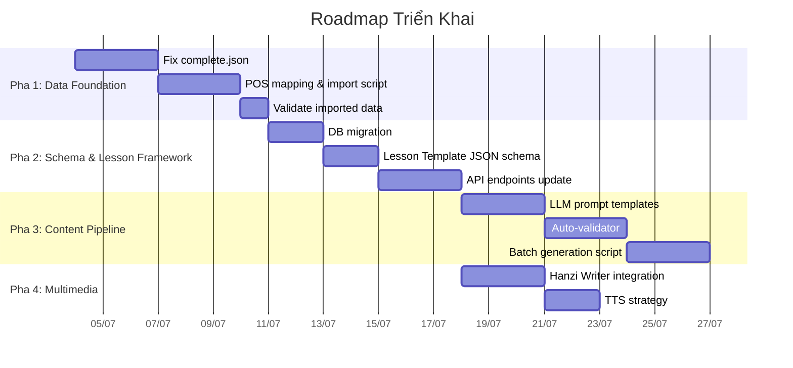
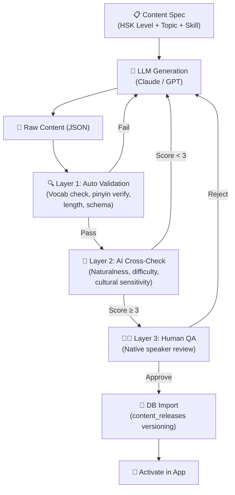

# Implementation Plan: Hệ Thống Bài Học HSK & Nền Tảng Dữ Liệu

## Bối Cảnh

Dự án [study-chinese](file:///d:/Project/study-chinese) cần:
1. Một **khung bài học chuẩn HSK 3.0** (Nghe–Nói–Đọc–Viết) modular, số hóa được
2. Một **nền tảng dữ liệu hợp pháp** — không vi phạm bản quyền

Qua nghiên cứu tiêu chuẩn HSK 3.0 và kiểm định file [complete.json](file:///d:/Project/study-chinese/data/complete.json) (11,470 mục từ, 9.76 MB), tôi tổng hợp toàn bộ phát hiện và kế hoạch hành động vào tài liệu này.

---

## Tóm Tắt Hiện Trạng

### Tiêu Chuẩn HSK 3.0 (2025+)

| Giai Đoạn | Cấp | Từ Vựng (tích lũy) | Chữ Hán | Ngữ Pháp | CEFR | Kỹ năng bắt buộc |
|:---|:---:|:---:|:---:|:---:|:---:|:---|
| **Sơ Cấp** | 1 | 300 | 300 | 48 | A1 | Nghe, Đọc |
| | 2 | 500 | 600 | 129 | A1–A2 | Nghe, Đọc, Viết (cơ bản) |
| | 3 | 1,000 | 900 | 210 | A2 | Nghe, Đọc, Viết, **Nói (bắt buộc)** |
| **Trung Cấp** | 4 | 2,000 | 1,200 | 286 | B1 | Cả 4 kỹ năng |
| | 5 | 3,600 | 1,500 | 357 | B1–B2 | Cả 4 kỹ năng |
| | 6 | 5,400 | 1,800 | 424 | B2 | Cả 4 kỹ năng |
| **Cao Cấp** | 7–9 | 11,092 | 3,000 | 572 | C1–C2 | Cả 4 + Dịch |

### Kết Quả Kiểm Định `complete.json` (Score: 8.2/10)

| Phát hiện | Mức độ | Chi tiết |
|:---|:---:|:---|
| ✅ Cấu trúc JSON | Tốt | 100% entries hoàn chỉnh, 5 hệ phiên âm, 0 duplicate |
| ✅ HSK spot check | Tốt | 20/20 từ HSK 1 đúng cấp và đúng pinyin |
| 🔴 Thiếu từ HSK 3.0 | Nghiêm trọng | **~1,035 từ** thiếu so với chuẩn (~9.3%), nặng ở HSK 6–7 |
| 🔴 Từ chỉ có `new-*` | Nghiêm trọng | **1,273 entries** không có tag `newest-*` — thiếu/bị loại? |
| 🟡 Không có POS tags | Trung bình | **250 entries** có `pos: []` — cần gán mặc định |
| 🟡 POS tags lạ | Trung bình | **8 tags** không chuẩn (`qv`, `tg`, `mq`, `qt`, `cc`, `Mg`, `nt`, `Rg`) |
| 🟡 Frequency sentinel | Trung bình | **93 entries** có `frequency: 1000000` — giá trị placeholder |
| 🟢 Variant-only entries | Nhẹ | **334 forms** chỉ có meaning "variant of..." — giá trị giáo dục thấp |
| 🟢 Pinyin ghép liền | Nhẹ | **29 entries** ghép liền syllable — đúng data, chỉ cần xử lý khi parse |

---

## Kế Hoạch Triển Khai — 4 Pha



---

## Pha 1: Data Foundation — Sửa & Import `complete.json`

> **Mục tiêu:** Có một bảng `words` hoàn chỉnh, chính xác theo chuẩn HSK 3.0.

### 1.1. Bổ Sung Từ Vựng Thiếu (~1,035 từ)

| Cấp | Có | Cần | Thiếu | Nguồn bổ sung |
|:---:|:---:|:---:|:---:|:---|
| HSK 1 | 294 | 300 | -6 | [drkameleon/complete-hsk-vocabulary](https://github.com/drkameleon/complete-hsk-vocabulary) |
| HSK 2 | 197 | 200 | -3 | Cross-reference `ivankra/hsk30` CSV |
| HSK 3 | 487 | 500 | -13 | Cross-reference `ivankra/hsk30` CSV |
| HSK 4 | 972 | 1,000 | -28 | Cross-reference |
| HSK 5 | 1,547 | 1,600 | -53 | Cross-reference |
| HSK 6 | 1,684 | 1,800 | -116 | Cross-reference + LLM lookup |
| HSK 7 | 4,876 | 5,692 | -816 | Cross-reference + LLM lookup |

#### [NEW] `server/scripts/patch-missing-vocab.mjs`

Script sẽ:
1. Tải HSK 3.0 word list từ `ivankra/hsk30` (CSV, MIT license)
2. Diff với `complete.json` → danh sách từ thiếu
3. Tra nghĩa từ CC-CEDICT (đã import vào `dictionary_entries`)
4. Sinh entries mới theo đúng format `complete.json`
5. Merge vào file, giữ nguyên entries hiện tại

---

### 1.2. POS Tag Mapping

#### Bảng mapping POS tags → giá trị `words.part_of_speech` trong DB

```
complete.json → DB schema
────────────────────────────────────
n, nr, ns, nz, nt        → noun
v, vn                    → verb
a, an, ad                → adjective
d                        → adverb
r, Rg                    → pronoun
m, Mg                    → numeral
q, qv, qt, mq            → measure
c, cc                    → conjunction
p                        → preposition
u, y                     → particle
e, o                     → interjection
h                        → prefix
k                        → suffix
l, i                     → idiom
b, g, tg, z, s, t, f     → other
(empty)                  → phrase  (mặc định cho 250 entries rỗng)
```

#### [NEW] `server/scripts/pos-mapping.mjs`

Module export hàm `mapPOS(rawTags: string[]): string` dùng cho import script.

---

### 1.3. Xử Lý Dữ Liệu Đặc Biệt

| Vấn đề | Xử lý khi import |
|:---|:---|
| `frequency: 1000000` (93 entries) | Set `frequency = NULL` trong DB |
| Entries chỉ có meaning "variant of..." (334) | Thêm cột `is_variant BOOLEAN DEFAULT false`, set `true` |
| 1,273 entries chỉ có `new-*` không có `newest-*` | Import với `hsk_level` từ `new-*`, đánh dấu `source = 'new'` |
| Pinyin ghép liền (29 entries) | Tách syllable bằng regex khi sinh `pinyin_plain` và `tones` |

---

### 1.4. Import Script

#### [NEW] `server/scripts/import-complete-json.mjs`

```
Input: data/complete.json (đã patch)
Output: INSERT/UPSERT vào bảng words

Logic:
1. Load complete.json
2. Với mỗi entry:
   a. Chọn hệ thống level: ưu tiên newest-* → fallback new-* → old-*
   b. Map POS tag → DB value (dùng pos-mapping.mjs)
   c. Lấy form[0] làm primary form:
      - simplified, traditional, pinyin, english
      - Sinh pinyin_plain (bỏ dấu thanh)
      - Sinh tones array (extract từ numeric)
      - Sinh search_text (simplified + pinyin_plain + english)
   d. Map HSK level → CEFR level (1→A1, 2→A1, 3→A2, 4→B1, 5→B2, 6→B2, 7→C1)
   e. Sinh word ID: format "hsk{level}-{pinyin_plain}-{index}"
   f. Xử lý frequency sentinel
   g. Lưu toàn bộ forms + level array vào JSONB phụ (nếu cần)
3. UPSERT vào DB theo simplified + pinyin primary key logic
4. Log kết quả: inserted / updated / skipped / errors
```

---

### 1.5. Migration: Mở Rộng Bảng `words`

#### [MODIFY] `server/schema.sql` (hoặc tạo migration file mới)

```sql
-- Thêm cột để track nguồn gốc & variant
ALTER TABLE words ADD COLUMN IF NOT EXISTS is_variant BOOLEAN DEFAULT false;
ALTER TABLE words ADD COLUMN IF NOT EXISTS level_sources JSONB DEFAULT '[]'::jsonb;
  -- Lưu array gốc: ["newest-1", "new-1", "old-1"]
ALTER TABLE words ADD COLUMN IF NOT EXISTS all_forms JSONB DEFAULT '[]'::jsonb;
  -- Lưu toàn bộ forms cho entries đa âm
ALTER TABLE words ADD COLUMN IF NOT EXISTS classifiers TEXT[] DEFAULT '{}';
  -- Lượng từ: 个, 份, 片...
```

### Deliverables Pha 1

- [ ] Script `patch-missing-vocab.mjs` — bổ sung ~1,035 từ thiếu
- [ ] Module `pos-mapping.mjs` — mapping 35+ POS tags → 16 giá trị DB
- [ ] Script `import-complete-json.mjs` — import vào bảng `words`
- [ ] Migration SQL cho cột mới trên bảng `words`
- [ ] Validation report sau import: so sánh count theo cấp với chuẩn HSK 3.0

### Verification Pha 1

```bash
# Chạy import (dry-run trước)
node scripts/import-complete-json.mjs --dry-run

# Import thật
node scripts/import-complete-json.mjs

# Verify counts
psql -c "SELECT hsk_level, COUNT(*) FROM words WHERE is_active=true GROUP BY hsk_level ORDER BY hsk_level"

# Verify spot check
psql -c "SELECT simplified, pinyin, english, hsk_level FROM words WHERE simplified IN ('你','好','我','爱','吃') ORDER BY simplified"
```

---

## Pha 2: Schema & Lesson Framework

> **Mục tiêu:** Database hỗ trợ khung bài học 4 kỹ năng, modular theo HSK 3.0.

### 2.1. Thiết Kế Khung Bài Học

Mỗi bài học tập trung **1 kỹ năng chính**, có thể có 1–2 kỹ năng phụ:

```
📦 Lesson
├── 📋 Metadata (id, hsk_level, primary_skill, topic...)
├── 🎯 Learning Objectives
├── 📖 Warm-Up Phase (1–2 phút)
├── 📚 Core Modules (1+ skill modules, JSONB)
│   ├── 🎧 Listening: tone drill → dialogue comprehension → inference
│   ├── 🗣️ Speaking: shadowing → role-play → free production
│   ├── 📖 Reading: character recognition → passage → analysis
│   └── ✍️ Writing: stroke order → sentence building → essay
├── 🏋️ Practice (exercises, cross-skill)
├── 🔄 Review + SRS inject
└── 📊 Assessment (score, XP)
```

#### Ma Trận Skill × Level

| Kỹ năng | HSK 1–2 | HSK 3–4 | HSK 5–6 | HSK 7–9 |
|:---|:---|:---|:---|:---|
| **Nghe** | Từ đơn, minimal pairs | Hội thoại 4–6 câu | Monologue dài, cloze | Bài giảng, suy luận |
| **Nói** | Shadowing, lặp lại | Q&A, role-play | Thảo luận, trình bày | Diễn thuyết, dịch |
| **Đọc** | Ghép chữ-hình, câu đơn | Đoạn 50–100 chữ | Bài 150–300 chữ | Luận, văn học |
| **Viết** | Stroke order | Sắp xếp từ, đặt câu | Viết đoạn 50–80 chữ | Viết luận 200+ chữ |

---

### 2.2. Database Migrations

#### [NEW] `server/migrations/001-lesson-framework.sql`

```sql
-- 1. Mở rộng bảng lessons
ALTER TABLE lessons ADD COLUMN IF NOT EXISTS primary_skill VARCHAR(20)
  CHECK (primary_skill IN ('listening', 'speaking', 'reading', 'writing', 'mixed'));
ALTER TABLE lessons ADD COLUMN IF NOT EXISTS secondary_skills VARCHAR(20)[];
ALTER TABLE lessons ADD COLUMN IF NOT EXISTS topic VARCHAR(50);
ALTER TABLE lessons ADD COLUMN IF NOT EXISTS learning_objectives JSONB DEFAULT '[]'::jsonb;
ALTER TABLE lessons ADD COLUMN IF NOT EXISTS warm_up JSONB;
ALTER TABLE lessons ADD COLUMN IF NOT EXISTS review_summary JSONB;
ALTER TABLE lessons ADD COLUMN IF NOT EXISTS difficulty_score DECIMAL(3,1) DEFAULT 1.0;
ALTER TABLE lessons ADD COLUMN IF NOT EXISTS tags TEXT[] DEFAULT '{}';

-- 2. Mở rộng bảng exercises
ALTER TABLE exercises ADD COLUMN IF NOT EXISTS skill VARCHAR(20)
  CHECK (skill IN ('listening', 'speaking', 'reading', 'writing', 'mixed'));
ALTER TABLE exercises ADD COLUMN IF NOT EXISTS bloom_level VARCHAR(20)
  CHECK (bloom_level IN ('remember', 'understand', 'apply', 'analyze', 'evaluate', 'create'));
ALTER TABLE exercises ADD COLUMN IF NOT EXISTS ai_grading_enabled BOOLEAN DEFAULT false;
ALTER TABLE exercises ADD COLUMN IF NOT EXISTS acceptable_variants JSONB DEFAULT '[]'::jsonb;

-- 3. Bảng mới: lesson_modules (skill modules per lesson)
CREATE TABLE IF NOT EXISTS lesson_modules (
  id VARCHAR(80) PRIMARY KEY,
  lesson_id VARCHAR(50) NOT NULL REFERENCES lessons(id) ON DELETE CASCADE,
  module_type VARCHAR(20) NOT NULL
    CHECK (module_type IN ('listening', 'speaking', 'reading', 'writing')),
  order_num INT NOT NULL DEFAULT 0,
  phases JSONB NOT NULL DEFAULT '[]'::jsonb,
  is_active BOOLEAN NOT NULL DEFAULT true,
  created_at TIMESTAMPTZ NOT NULL DEFAULT now(),
  updated_at TIMESTAMPTZ NOT NULL DEFAULT now()
);
CREATE INDEX IF NOT EXISTS idx_lesson_modules_lesson ON lesson_modules (lesson_id, order_num);

-- 4. Bảng mới: dialogues (tái sử dụng cho Listening & Speaking)
CREATE TABLE IF NOT EXISTS dialogues (
  id VARCHAR(80) PRIMARY KEY,
  lesson_id VARCHAR(50) REFERENCES lessons(id) ON DELETE SET NULL,
  title_zh VARCHAR(200),
  title_en VARCHAR(200),
  hsk_level INT NOT NULL DEFAULT 1,
  topic VARCHAR(50),
  lines JSONB NOT NULL DEFAULT '[]'::jsonb,
  audio_full_ref VARCHAR(255),
  word_count INT,
  is_active BOOLEAN NOT NULL DEFAULT true,
  created_at TIMESTAMPTZ NOT NULL DEFAULT now(),
  updated_at TIMESTAMPTZ NOT NULL DEFAULT now()
);

-- 5. Bảng mới: reading_passages
CREATE TABLE IF NOT EXISTS reading_passages (
  id VARCHAR(80) PRIMARY KEY,
  lesson_id VARCHAR(50) REFERENCES lessons(id) ON DELETE SET NULL,
  title_zh VARCHAR(200),
  title_en VARCHAR(200),
  hsk_level INT NOT NULL DEFAULT 1,
  topic VARCHAR(50),
  content_zh TEXT NOT NULL,
  content_pinyin TEXT,
  content_en TEXT,
  word_count INT NOT NULL,
  new_word_ids JSONB NOT NULL DEFAULT '[]'::jsonb,
  grammar_point_ids JSONB NOT NULL DEFAULT '[]'::jsonb,
  questions JSONB NOT NULL DEFAULT '[]'::jsonb,
  is_active BOOLEAN NOT NULL DEFAULT true,
  created_at TIMESTAMPTZ NOT NULL DEFAULT now(),
  updated_at TIMESTAMPTZ NOT NULL DEFAULT now()
);

-- 6. Bảng mới: content_generation_logs (track LLM output)
CREATE TABLE IF NOT EXISTS content_generation_logs (
  id UUID PRIMARY KEY DEFAULT gen_random_uuid(),
  content_type VARCHAR(30) NOT NULL
    CHECK (content_type IN ('dialogue', 'passage', 'exercise', 'grammar_explanation', 'lesson')),
  target_lesson_id VARCHAR(50) REFERENCES lessons(id) ON DELETE SET NULL,
  hsk_level INT NOT NULL,
  topic VARCHAR(50),
  skill VARCHAR(20),
  prompt_used TEXT NOT NULL,
  model_name VARCHAR(100) NOT NULL,
  raw_output JSONB NOT NULL,
  validation_result JSONB,
  ai_review_result JSONB,
  human_reviewer_id UUID REFERENCES users(id) ON DELETE SET NULL,
  status VARCHAR(20) NOT NULL DEFAULT 'pending'
    CHECK (status IN ('pending', 'auto_validated', 'ai_reviewed', 'human_approved', 'rejected')),
  revision_count INT NOT NULL DEFAULT 0,
  created_at TIMESTAMPTZ NOT NULL DEFAULT now(),
  updated_at TIMESTAMPTZ NOT NULL DEFAULT now()
);

-- Triggers
CREATE TRIGGER trg_lesson_modules_updated_at BEFORE UPDATE ON lesson_modules
  FOR EACH ROW EXECUTE FUNCTION set_updated_at();
CREATE TRIGGER trg_dialogues_updated_at BEFORE UPDATE ON dialogues
  FOR EACH ROW EXECUTE FUNCTION set_updated_at();
CREATE TRIGGER trg_reading_passages_updated_at BEFORE UPDATE ON reading_passages
  FOR EACH ROW EXECUTE FUNCTION set_updated_at();
CREATE TRIGGER trg_content_generation_logs_updated_at BEFORE UPDATE ON content_generation_logs
  FOR EACH ROW EXECUTE FUNCTION set_updated_at();
```

### 2.3. Lesson Template JSON Schema

#### [NEW] `data/schemas/lesson-template.schema.json`

Định nghĩa JSON Schema (draft-07) cho lesson template — dùng để validate output từ LLM và dữ liệu thủ công. Cấu trúc core:

```json
{
  "lesson_id": "hsk3-L12-listening-shopping",
  "metadata": {
    "title_zh": "在商店买东西",
    "title_en": "Shopping at a Store",
    "hsk_level": 3,
    "cefr_level": "A2",
    "primary_skill": "listening",
    "secondary_skills": ["speaking"],
    "topic": "shopping",
    "estimated_minutes": 10,
    "xp_reward": 30,
    "tags": ["daily_life", "numbers"]
  },
  "learning_objectives": [...],
  "vocabulary_focus": [{ "word_id": "...", "simplified": "买", "is_new": true }],
  "grammar_focus": [{ "pattern": "...多少钱？", "examples": [...] }],
  "warm_up": { "type": "vocabulary_review", "items": [...] },
  "core_modules": [{ "module_type": "listening", "phases": [...] }],
  "practice": { "exercises": [...] },
  "review": { "key_takeaways": [...], "srs_inject_word_ids": [...] }
}
```

### 2.4. API Endpoints

#### [MODIFY] `server/src/routes/lessons.js`

Mở rộng endpoints hiện tại để hỗ trợ lesson modules:

| Method | Endpoint | Thay đổi |
|:---|:---|:---|
| `GET` | `/api/v1/lessons` | Thêm filter `?skill=listening&topic=shopping` |
| `GET` | `/api/v1/lessons/:id` | Include `lesson_modules`, `dialogues`, `reading_passages` |
| `GET` | `/api/v1/lessons/:id/modules` | **[NEW]** Lấy danh sách skill modules |
| `GET` | `/api/v1/dialogues/:id` | **[NEW]** Lấy dialogue |
| `GET` | `/api/v1/passages/:id` | **[NEW]** Lấy reading passage |

### Deliverables Pha 2

- [ ] Migration file `001-lesson-framework.sql`
- [ ] JSON Schema file cho lesson template
- [ ] Cập nhật API routes cho lessons, dialogues, passages
- [ ] Cập nhật Swagger/OpenAPI spec

### Verification Pha 2

```bash
# Chạy migration
npm --prefix server run db:migrate -- migrations/001-lesson-framework.sql

# Test API
curl http://localhost:5000/api/v1/lessons?skill=listening&hsk_level=3
```

---

## Pha 3: Content Generation Pipeline

> **Mục tiêu:** Pipeline bán tự động sinh nội dung bài học hợp pháp bằng LLM.

### 3.1. Chiến Lược Bản Quyền

| Loại nội dung | Tình trạng | Nguồn |
|:---|:---|:---|
| Danh sách từ vựng HSK (chữ, pinyin, cấp) | ✅ Public syllabus | `complete.json` + open-source repos |
| Định nghĩa tiếng Anh | ✅ CC BY-SA 3.0 | CC-CEDICT (đã import) |
| Stroke order data | ✅ MIT + Arphic License | Hanzi Writer + Make Me a Hanzi |
| Hội thoại, bài đọc, bài tập | ❌ Cần tự tạo | → **LLM sinh nội dung gốc** |
| Audio | ❌ Cần tự tạo | → Edge TTS / open-source TTS |
| Giải thích ngữ pháp | ⚠️ Cần viết lại | → LLM sinh + chuyên gia review |

### 3.2. Pipeline Tổng Quan



### 3.3. LLM Prompt Templates

#### [NEW] `data/prompts/generate-dialogue.txt`

Prompt cho sinh hội thoại — rules:
1. CHỈ dùng từ HSK {level} trở xuống
2. Tự nhiên, không sao chép sách giáo khoa
3. Output JSON theo schema đã định

#### [NEW] `data/prompts/generate-passage.txt`

Prompt cho sinh bài đọc — constraint về word count, new word limit, grammar patterns.

#### [NEW] `data/prompts/generate-exercises.txt`

Prompt cho sinh bài tập — đa dạng loại (MCQ, fill-blank, word-order, match, cloze).

#### [NEW] `data/prompts/review-content.txt`

Prompt cho LLM reviewer — đánh giá 5 tiêu chí (naturalness, level, culture, pedagogy, translation).

### 3.4. Auto Validator

#### [NEW] `server/src/services/content-validator.js`

Class `ContentValidator` với các checks:

| Check | Loại | Mô tả |
|:---|:---|:---|
| `vocabCheck()` | Error | Mọi từ Trung phải nằm trong danh sách HSK ≤ target level |
| `pinyinVerify()` | Error | Pinyin phải khớp với Hán tự (tra từ bảng `words`) |
| `lengthCheck()` | Warning | Word count nằm trong range cho level |
| `schemaValidate()` | Error | JSON output phải match lesson template schema |
| `duplicateDetect()` | Warning | Similarity < 85% với nội dung đã có |
| `grammarCheck()` | Warning | Ngữ pháp sử dụng phù hợp cấp |

### 3.5. Batch Generation Script

#### [NEW] `server/scripts/generate-lesson-content.mjs`

```
Usage: node scripts/generate-lesson-content.mjs --level 3 --topic shopping --skill listening

Flow:
1. Load HSK vocab list cho level
2. Sinh dialogue + passage + exercises qua LLM API
3. Chạy auto-validator
4. Nếu pass → lưu vào content_generation_logs (status: auto_validated)
5. Nếu fail → retry với prompt điều chỉnh (max 3 lần)
```

### Deliverables Pha 3

- [ ] 4 prompt template files
- [ ] `ContentValidator` service
- [ ] `generate-lesson-content.mjs` batch script
- [ ] 10 bài mẫu sinh cho HSK 1–3 (mỗi cấp ~3 bài) để test pipeline

### Verification Pha 3

```bash
# Sinh 1 bài mẫu
node scripts/generate-lesson-content.mjs --level 2 --topic food --skill reading --dry-run

# Chạy validator riêng
node -e "import('./src/services/content-validator.js').then(m => m.validateLesson(require('./test-lesson.json'), 2))"

# Kiểm tra DB
psql -c "SELECT content_type, status, COUNT(*) FROM content_generation_logs GROUP BY content_type, status"
```

---

## Pha 4: Multimedia & Frontend Integration

> **Mục tiêu:** Tích hợp Hanzi Writer, tối ưu audio, và chuẩn bị hình ảnh.

### 4.1. Hanzi Writer (Stroke Order Animation)

| Component | Giải pháp | License |
|:---|:---|:---|
| JS Library | [hanzi-writer](https://hanziwriter.org/) v3.x | MIT |
| Stroke Data | [Make Me a Hanzi](https://github.com/skishore/makemeahanzi) | Arphic Public License |
| Decomposition | UniHan + CJK IDS | Unicode License |

#### [MODIFY] `client/package.json`

```
npm install hanzi-writer
```

#### [NEW] `client/src/components/HanziStrokePractice.tsx`

Component wrapping Hanzi Writer với:
- Demo mode (animation nét viết)
- Quiz mode (user vẽ, AI chấm)
- Kết nối SRS (track mistakes)

### 4.2. Audio Strategy (Kiến Trúc 2 Tầng)

| Tầng | Dùng cho | Giải pháp | Đã có? |
|:---|:---|:---|:---|
| **Real-time** | Từ đơn, câu ngắn | Edge TTS qua `/api/v1/audio` | ✅ Đã có |
| **Pre-rendered** | Hội thoại, bài đọc | MeloTTS hoặc Qwen3-TTS (batch) | ❌ Cần xây |

#### [NEW] `server/scripts/generate-audio-batch.mjs`

Batch generate MP3 cho dialogues/passages mới → lưu vào `data/audio/` hoặc CDN.

### 4.3. Attribution File

#### [MODIFY] [ATTRIBUTIONS.md](file:///d:/Project/study-chinese/ATTRIBUTIONS.md)

Thêm credits cho:
- Hanzi Writer (MIT)
- Make Me a Hanzi (Arphic Public License)
- CC-CEDICT (CC BY-SA 3.0) — đã có
- Open-source HSK vocabulary repos (MIT)

### Deliverables Pha 4

- [ ] `HanziStrokePractice` React component
- [ ] Audio batch generation script
- [ ] Cập nhật ATTRIBUTIONS.md

---

## Open Questions

> [!IMPORTANT]
> ### Cần Xác Nhận Trước Khi Triển Khai
>
> **1. Phạm vi HSK:** Triển khai **HSK 1–6** trước (5,400 từ) hay cả **HSK 1–7+** (11,000+ từ)?  
> *Đề xuất:* HSK 1–6 trước, HSK 7+ là phase riêng sau.
>
> **2. 1,273 từ chỉ có `new-*`:** Đây là từ bị loại khỏi HSK 3.0, hay dữ liệu `newest-*` chưa cập nhật?  
> *Ảnh hưởng:* Nếu import hết → thừa từ; nếu bỏ qua → có thể thiếu.  
> *Đề xuất:* Import nhưng đánh dấu `source='new_only'`, không hiển thị trong bài học chính.
>
> **3. LLM Provider cho Content Gen:** Dùng Groq (đang có), Claude API, hay OpenAI cho sinh nội dung?  
> *Lưu ý:* Claude có xu hướng output tiếng Trung tự nhiên hơn. Groq rẻ nhất nhưng model giới hạn.
>
> **4. Audio:** Giữ Edge TTS cho tất cả, hay self-host MeloTTS? Cần GPU server không?  
> *Đề xuất:* Giữ Edge TTS, chỉ thêm MeloTTS nếu cần multi-voice cho dialogue.
>
> **5. Ưu tiên kỹ năng triển khai:**  
> *Đề xuất:* **Đọc + Nghe** trước → **Viết** (Hanzi Writer) → **Nói** (cần STT/ASR).
>
> **6. Content Volume:** Bao nhiêu bài/cấp? *Ước lượng:* ~30–50 bài × 6 cấp = **180–300 bài**.

---

## Verification Plan

### Pha 1 (Data)
- `npm --prefix server run test` — unit tests cho import/mapping
- SQL count queries so sánh với chuẩn HSK 3.0
- Spot check 50 từ ngẫu nhiên mỗi cấp

### Pha 2 (Schema)
- Migration chạy clean trên DB trống + DB hiện tại (backward-compatible)
- API integration tests: `npm --prefix server run test:integration`

### Pha 3 (Content)
- 10 bài mẫu qua full pipeline (LLM → validate → review)
- Native speaker review score ≥ 4/5 trên ≥ 80% bài

### Pha 4 (Multimedia)
- Hanzi Writer render đúng 100 ký tự HSK 1–2
- Audio A/B test: Edge TTS vs MeloTTS (nếu applicable)
- Cross-browser testing cho stroke practice
